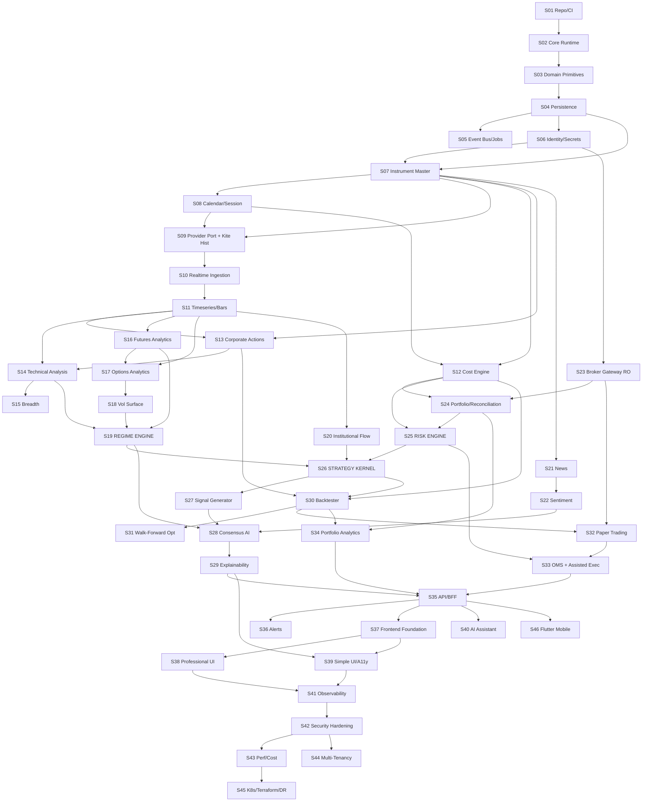

# D.H.R.U.V.A — MASTER PROJECT PLAN

> **HISTORICAL REFERENCE — AR-002 (2 August 2026).** This institutional plan is
> retained as permanent engineering history, but its S07–S46 sequence is
> **indefinitely deferred as an active roadmap**. The owner-approved, reissued
> active plan is [`DHRUVA_PERSONAL_MVP_PLAN.md`](DHRUVA_PERSONAL_MVP_PLAN.md).
> Accepted ADRs and architecture controls remain binding unless explicitly
> superseded.

**Dynamic Heuristic Regime Understanding & Volatility Analytics**
Institutional AI Quant Trading Platform — Governing Engineering Document

| Field | Value |
|---|---|
| Document ID | DHRUVA-MPP |
| Version | **1.4 — APPROVED** |
| Date | 26 July 2026 |
| Author | CTO / Principal Architect (AI Engineering Lead) |
| Status | **HISTORICAL REFERENCE** — superseded as the active roadmap by AR-002 |
| Supersedes | v1.3, v1.2, v1.1, v1.0 (all 26 July 2026) |
| Active successor | `DHRUVA_PERSONAL_MVP_PLAN.md` v1.0 |
| Governs | Historical architecture and accepted constraints, except where AR-002 narrows active product scope |

> **This document is the project's permanent engineering memory.**
> Every future response builds on Sections 4 (Decision Log), 6 (Subsystem Catalogue), and 10 (Definition of Done).
> No decision recorded here may be silently changed. Changes require an explicit **Architecture Revision (AR-nnn)** that supersedes the original ADR and states the reason.

### AMENDMENT RECORD — v1.0 → v1.1

Approved by the Product Owner on 26 July 2026 with the following amendments, all of which are incorporated below.

| # | Amendment | Incorporated at |
|---|---|---|
| A1 | Modular monolith approved. Kafka, Kubernetes and distributed messaging deferred. Modules must be designed for future extraction. | Confirms ADR-001, ADR-002. No change required. |
| A2 | SEBI compliance approach approved, with **explicit user confirmation required on every order**, a **hard OMS rate governor**, a **complete audit trail**, and **broker approval as a release blocker**. | Confirms ADR-012, ADR-014, ADR-015, ADR-016, ADR-026 and Gate G5. §2.2 consequence 1 strengthened from "one order per click" to "explicit per-order user confirmation". |
| A3 | Zerodha snapshot limitation accepted. HFT, latency arbitrage and order-book microstructure are permanently out of scope. | Confirms §2.1 and §19.2. Restated as a hard anti-goal. |
| A4 | **MCP-first delivery approved.** Execution subsystems are deferred until the analytics platform has demonstrated value. | **New ADR-028.** §1.3, §8 and §9 revised: MCP (S01–S20 + thin UI slice) is now the approved delivery target; G-MCP added as a decision gate. |
| A5 | An ADR is mandatory for every major architectural decision. Approved architecture is never silently modified. | **New ADR-027**, formalising ADR lifecycle, statuses, supersession and the Architecture Revision process. |

### AMENDMENT RECORD — v1.1 → v1.2

Approved by the Product Owner on 26 July 2026, on approval of Subsystem S01.

| # | Amendment | Incorporated at |
|---|---|---|
| A6 | **Version control is part of the Definition of Done.** Every approved subsystem is committed and pushed immediately. No subsystem may begin while a previous one sits uncommitted. Each subsystem delivers a branch name, Conventional Commit messages, a PR title and summary, and a tag recommendation. | **New ADR-029.** §10.1 Definition of Done extended; §13.4 workflow expanded; §18 documentation table updated. |
| A7 | **Documentation is synchronised with implementation, not trailing it.** Every subsystem updates ADRs, the decision log, the CHANGELOG, the README where behaviour changes, and API documentation where applicable. | **New ADR-030.** §10.1 and §18 extended; `CHANGELOG.md` added to the repository. |
| A8 | The six quality gates are confirmed as the standing set. New gates are added only where they provide measurable value. | Confirms §10.1 and §14. Recorded in ADR-030's consequences. |

### AMENDMENT RECORD — v1.2 → v1.3

Approved by the Product Owner on 26 July 2026, on approval of the S02 architecture.

| # | Amendment | Incorporated at |
|---|---|---|
| — | **Configuration placement clarified.** Process configuration belongs to the shared kernel; the Platform context (C9) owns only persisted, account-scoped configuration. Boundary rule **R5** forbids reading `os.environ` outside `shared.config`. | **New ADR-031.** §5 C9 row annotated. Recorded as a *clarification* of §5, not a redesign. |
| A9 | **Reproducible builds.** Pinned dependencies, committed lockfile, documented Python version, OS baseline and external tool versions. CI builds from a clean checkout. | **New ADR-032.** §10.1 and §13.3 extended; `docs/BUILD.md` added. |
| A10 | **Secrets management.** No secret in the repository at any commit. Credentials come only from the configuration provider. Automated secret scanning over full history. `.env.example` only. | **New ADR-033.** §15.1 extended; secret-hygiene tests added. |
| A11 | **Release governance.** Every subsystem ships a changelog entry, ADR updates, a version tag, release notes, migration notes and rollback instructions. | **New ADR-034.** §10.1 extended; `docs/releases/` added; §18 updated. |
| A12 | **Observability first.** Every runtime component from S02 onward exposes structured logs, correlation IDs, health, readiness, metrics and traces at the moment it is introduced. | **New ADR-035.** **S02 scope expands** (see §6 note); §16 reframed; per-subsystem DoD extended. |
| A13 | **Performance budgets.** Every subsystem declares measurable targets in Step 1, before implementation, each backed by a committed benchmark. | **New ADR-036.** §12 extended; design-document format gains a budget section. |

### AMENDMENT RECORD — v1.3 → v1.4

Approved on completion of the S02 implementation.

| # | Amendment | Incorporated at |
|---|---|---|
| A14 | **Technical Debt Register.** From S03 onward every subsystem records deferred improvements, known limitations, rationale, effort, priority and target milestone. | **New ADR-041.** §10.1 and §18 extended; design-document format gains a register section. S02 carries one as precedent. |
| — | Four runtime decisions raised in the S02 design and accepted on implementation. | **New ADR-037** (redaction as a tested control), **ADR-038** (error taxonomy), **ADR-039** (correlation), **ADR-040** (OpenTelemetry split). Originally planned as 031–035; renumbered because the v1.3 policies claimed those numbers, and ADR-027 forbids reuse. |

---

## TABLE OF CONTENTS

1. [Product Thesis & Scope Boundary](#1-product-thesis--scope-boundary)
2. [Governing Constraints — The Reality Layer](#2-governing-constraints--the-reality-layer)
3. [Architecture North Star](#3-architecture-north-star)
4. [Project Decision Log (ADR-001 … ADR-041)](#4-project-decision-log)
5. [Bounded Contexts & Service Boundaries](#5-bounded-contexts--service-boundaries)
6. [Subsystem Catalogue](#6-subsystem-catalogue)
7. [Dependency Graph](#7-dependency-graph)
8. [Phases, Milestones & Hard Gates](#8-phases-milestones--hard-gates)
9. [Recommended Implementation Sequence](#9-recommended-implementation-sequence)
10. [Definition of Done](#10-definition-of-done)
11. [Engineering Risk Register](#11-engineering-risk-register)
12. [Non-Functional Requirements & Budgets](#12-non-functional-requirements--budgets)
13. [Coding Standards & Repository Conventions](#13-coding-standards--repository-conventions)
14. [Testing Strategy](#14-testing-strategy)
15. [Security & Compliance Plan](#15-security--compliance-plan)
16. [Observability & SLOs](#16-observability--slos)
17. [Deployment & Environment Strategy](#17-deployment--environment-strategy)
18. [Documentation Standards](#18-documentation-standards)
19. [Explicit Anti-Goals](#19-explicit-anti-goals)
20. [Approval Block](#20-approval-block)

---

## 1. PRODUCT THESIS & SCOPE BOUNDARY

### 1.1 Thesis

Retail and semi-professional Indian traders are structurally disadvantaged not by lack of data, but by lack of **regime awareness** and **honest cost accounting**. Most retail tooling shows indicators; almost none of it tells the user *what kind of market this is*, *what that implies for the strategy they are running*, and *what the trade actually costs after STT, stamp duty, GST, slippage, and impact*.

D.H.R.U.V.A's differentiator is the intersection of three things, in priority order:

1. **Regime detection** — classify the market state (trend / mean-revert / high-vol / crush / event-driven) and condition every downstream signal on it.
2. **Brutally honest cost and risk modelling** — an Indian-market cost engine accurate to the paisa, applied identically in backtest, paper, and live. A strategy that is profitable gross and negative net must be *shown* to be negative.
3. **Explainability** — every signal ships a structured evidence bundle. No black-box numbers on screen ever.

Everything else in the feature list is table stakes that must exist to make the above credible.

### 1.2 Confirmed Scope Parameters (from Product Owner, 26 Jul 2026)

| Parameter | Decision | Architectural Consequence |
|---|---|---|
| **Resourcing** | Solo engineer + AI pair (serial execution) | No parallel workstreams. Ruthless phase gating. Modular monolith over microservices. Every subsystem must be *finishable* by one person. |
| **Tenancy** | Single-user v1, multi-tenant-**ready** | `account_id` on every domain row from day one. No global singletons. RLS policies authored but permissive in v1. Billing/onboarding deferred to P6. |
| **Automation ceiling** | Signals + **one-click assisted execution** (human approves every order) | Full OMS, risk gates, reconciliation required. **No unattended strategy execution in v1.** Materially reduces SEBI algo surface (see §2.2). |
| **Market data** | Provider-abstracted; **only Kite implemented in v1** | `MarketDataProvider` port with adapters. Kite is one adapter, not the domain model. Vendor swap must be a config change, not a rewrite. |

### 1.3 Approved Delivery Target — MCP First (Amendment A4)

Delivery is now sequenced in two approved stages. **Stage 2 is not authorised until Stage 1 demonstrates value at Gate G-MCP.**

| Stage | Contents | Subsystems | Effort | Gate |
|---|---|---|---|---|
| **Stage 1 — Minimum Credible Product** | Platform kernel, market data spine, full analytics core, thin read-only dashboard. **No execution of any kind.** | S01–S20 + MCP-UI slice | ~139 sessions (~28 weeks) | **G-MCP** |
| **Stage 2 — Full Platform** | Intelligence, decision, validation and execution layers, full dual-mode UI | S21–S40 | ~170 sessions | G3 → G6 |

### 1.3.1 Full v1.0 Scope (Stage 1 + Stage 2)

Market data spine · instrument master · trading calendar · corporate actions · cost engine · technical analytics · breadth · futures analytics · options analytics · regime detection · institutional flow · news + sentiment · risk engine · signal generator · consensus layer · explainability · backtesting · walk-forward optimisation · portfolio engine · paper trading · assisted live execution · portfolio analytics · alerts · web UI (Simple + Professional) · AI assistant.

### 1.4 Deferred Beyond v1.0

Flutter mobile client · multi-tenant activation & billing · Kubernetes · Kafka · fully automated execution · non-Kite data adapters · voice support (design accommodated, implementation deferred) · options market-making · intraday microstructure strategies (see §2.1 — infeasible on Kite data).

---

## 2. GOVERNING CONSTRAINTS — THE REALITY LAYER

These are not preferences. They are hard external constraints that dictate the architecture. Every subsystem design must be checked against this section.

### 2.1 Zerodha Kite Connect — Hard Technical Limits

| Constraint | Value | Architectural Consequence |
|---|---|---|
| WebSocket instruments per connection | **3,000** | A **Subscription Manager** is a first-class subsystem (S10), not a detail. It must priority-rank instruments and rotate the tail. |
| WebSocket connections per API key | **3** (→ ~9,000 instruments max) | Even at maximum, the full NSE F&O universe cannot be streamed. Universe selection is a *product decision*, encoded as policy. |
| Historical candle API | ~3 req/s (documented); treat **2 req/s** as the safe budget | Backfill is a long-running, resumable, rate-governed job. A naive loop will get the key throttled or banned. |
| Order placement | ~10 orders/s, ~200/min, ~3,000/day | Hard governor in the OMS. Also the SEBI algo threshold — see §2.2. |
| Access token lifetime | Expires daily (~06:00 IST); requires interactive login + TOTP | **Unattended 24/7 operation is impossible on Kite.** A daily "Market Open Ritual" (human-in-the-loop re-auth) is a designed feature, not a bug workaround. |
| Tick semantics | Ticks are **~1/sec snapshots**, not a trade-by-trade feed | **Microstructure / HFT / order-flow-imbalance strategies are structurally infeasible.** Declared out of scope. Do not design for them. Do not backtest as if ticks are trades. |
| Historical depth / order book | Not available | Full order book reconstruction is impossible. GEX, PCR, OI analytics must be built from snapshot-derived series only, and must be labelled as such. |

> **VERIFY-AT-S09:** Exact per-endpoint rate limits, quote-batch sizes, and historical-data entitlement/pricing must be re-confirmed against live Kite Connect documentation during the S09 spike before any code is written. Published third-party figures are treated as *indicative only*.

### 2.2 SEBI Algorithmic Trading Framework — Regulatory Constraint

SEBI Circular SEBI/HO/MIRSD/MIRSD-PoD/P/CIR/2025/0000013 (4 Feb 2025) established a retail algo framework. The rollout completed and the framework became **fully mandatory on 1 April 2026** — i.e. it is **live today**.

Material points for this project:

- Every algorithmic order must carry an **exchange-assigned Algo-ID**, enabling order-level traceability.
- The **broker is the principal**; algo providers are agents. No direct exchange connectivity.
- Systems exceeding **10 orders per second per market segment** are classified as algo trading requiring per-algorithm exchange registration.
- Orders below the threshold are **not exempt from classification** — they still require a *generic Algo ID* from the exchange, but avoid the per-strategy approval process.
- Retail traders using **self-developed, white-box logic for their own and immediate-family accounts** are generally treated as regular API users under the broker's registration.

**Consequences — binding on all future design:**

1. D.H.R.U.V.A v1 requires **explicit user confirmation of every individual order** (Amendment A2). No batch approval, no "approve all", no standing authorisation. Order rate is therefore bounded by human reaction time, orders of magnitude below the 10 OPS threshold.
2. The OMS must nevertheless enforce a **hard rate governor** (default ceiling 2 orders/sec, configurable downward only) that is *architecturally impossible to bypass*. This is a regulatory control, not a performance feature.
3. The OMS must **carry and persist the broker-supplied Algo-ID / order tag** on every order and store it in the immutable order ledger for audit.
4. Before Gate **G5 (live money)**, written confirmation of API-usage terms must be obtained from Zerodha in the account holder's name and filed in `docs/compliance/`.
5. Any future move to unattended execution is an **Architecture Revision**, not an increment.

> **Not legal advice.** I am an engineer, not a lawyer or a registered investment adviser. Regulatory interpretation must be confirmed with Zerodha's compliance desk and, if the platform is ever offered to third parties, with a SEBI-competent legal adviser.

### 2.3 Indian Market Structure — Domain Constraints

| Constraint | Detail | Consequence |
|---|---|---|
| **Expiry regime changed** | Effective 1 Sep 2025: **NSE derivatives expire Tuesday**, **BSE derivatives expire Thursday**. Ended a 25-year Thursday convention. | The Calendar Engine (S08) must be **rule-based and effective-dated**, never hardcoded. It must correctly answer "what was the expiry rule on 2025-06-15?" for backtests spanning the change. This alone invalidates most naive backtesting libraries. |
| **Holiday calendar** | Trading holidays, settlement holidays, Muhurat trading (special session), mid-session halts | Calendar is a queryable service with session-level granularity, not a list of dates. |
| **Charges** | Brokerage, STT, CTT, exchange txn charges, SEBI fees, stamp duty (state-varying), GST 18% (CGST/SGST/IGST split), DP charges, auto-square-off charges | Cost rules are **effective-dated versioned rule sets**. Rates change by circular. A backtest of 2023 must use 2023 rates. |
| **Margin regime** | SPAN + Exposure, peak margin reporting, intraday leverage rules | Margin is a pre-trade gate, sourced from broker where possible, modelled where not, and always labelled with its provenance. |
| **F&O restrictions** | Security-wise ban list, MWPL utilisation | Ban-list state must be tracked daily and enforced pre-trade. A signal on a banned scrip must be blocked with an explicit reason. |
| **Corporate actions** | Dividends, splits, bonus, rights, mergers | Adjustment engine required or every long-horizon backtest is wrong. Store **unadjusted** prices + an adjustment factor series; adjust at read time. |

### 2.4 Data Volume Reality

Order-of-magnitude sizing to design against (to be validated empirically at S11):

- 3,000 instruments × ~1 tick/sec × ~184 bytes ≈ **550 KB/s** ≈ ~2 GB/hour ≈ **~12 GB per trading day raw**.
- With TimescaleDB native compression (~10–20×) ≈ **~0.7–1.3 GB/day** ≈ **~200–330 GB/year**.
- Options chains dominate this. Retention policy is therefore a **design requirement from S11**, not an afterthought.

**Retention policy (initial):** raw ticks hot 30 days → compressed 12 months → 1-minute bars retained indefinitely → tick archive to cold object storage (Parquet) beyond 12 months.

### 2.5 The Cold-Start Problem

Kite historical data availability is limited and paywalled; the tick archive starts empty on day one. Therefore:

- The **tick archiver must be running in production before any research is credible.** This is why S10/S11 sit in Phase 1, ahead of all analytics.
- Every backtest report must display a **data-provenance banner**: source, date range, adjustment status, and known gaps.
- Strategies validated on <2 years of data are labelled **PROVISIONAL** in the UI and are ineligible to pass Gate G5.

---

## 3. ARCHITECTURE NORTH STAR

### 3.1 Shape

**A modular monolith with strictly enforced bounded contexts, deployed as a small number of processes, designed for later extraction into services.**

This is the single most important decision in the document, so the reasoning is stated in full:

- A solo engineer building 15 microservices builds 15 deployment problems and zero features. Distributed systems are a *tax you pay for organisational scale you do not have*.
- However, a monolith that becomes a mud ball cannot be extracted later. So the boundaries are enforced **at build time** from day one: each context is a Python package with a public API module, and an import-linter contract in CI **fails the build** on cross-context imports that bypass the public API.
- Every inter-context call already goes through an interface that could be a network call. Extraction later is mechanical.

**Processes in v1 (4):**

| Process | Responsibility |
|---|---|
| `dhruva-api` | FastAPI — HTTP/WS, serves web UI, orchestrates commands |
| `dhruva-ingest` | Long-lived tick ingestion + subscription management |
| `dhruva-worker` | Celery — backfills, backtests, model training, nightly jobs |
| `dhruva-scheduler` | Celery beat — calendar-aware job triggers |

Plus `postgres` (TimescaleDB), `redis`, and (from P5) `nginx`, `prometheus`, `grafana`, `loki`.

### 3.2 Layering (Clean Architecture, per context)

```
   ┌─────────────────────────────────────────────────────┐
   │  interfaces/   FastAPI routers, CLI, WS handlers,    │
   │                Celery task entrypoints               │
   ├─────────────────────────────────────────────────────┤
   │  application/  Use cases, command/query handlers,    │
   │                Unit of Work orchestration, DTOs      │
   ├─────────────────────────────────────────────────────┤
   │  domain/       Entities, value objects, domain       │
   │                services, domain events, PORTS        │
   │                (zero I/O, zero framework imports)    │
   ├─────────────────────────────────────────────────────┤
   │  infrastructure/ SQLAlchemy repos, Kite adapter,     │
   │                Redis bus, HTTP clients — ADAPTERS    │
   └─────────────────────────────────────────────────────┘
              Dependencies point INWARD only.
```

`domain/` importing anything from `infrastructure/` is a CI failure. This rule has no exceptions.

### 3.3 Communication Patterns

| Pattern | Used for | Mechanism |
|---|---|---|
| Synchronous command | User-initiated actions requiring an immediate answer | Direct in-process call via application service |
| Domain event (async) | Cross-context reactions (`TickBatchIngested` → analytics) | Redis Streams with consumer groups, Kafka-compatible envelope |
| Query | Read models for the UI | Dedicated read repositories / materialised views, bypassing the domain layer |
| Long-running job | Backfill, backtest, WFO, training | Celery with progress events and cancellation |
| Realtime push | Live prices, alerts, order status to UI | Server WebSocket fanned out from Redis pub/sub |

---

## 4. PROJECT DECISION LOG

**These decisions are binding.** Format: `ADR-nnn — Title — Decision — Rationale — Consequence`.

---

**ADR-001 — Modular monolith, not microservices.**
*Decision:* Single codebase, 4 processes, build-time-enforced context boundaries via `import-linter`. Service extraction only when a context has a demonstrated independent scaling or availability need.
*Rationale:* Solo team. Distributed systems cost is organisational, not technical.
*Consequence:* Kubernetes deferred to P6. Docker Compose is the deployment unit through P5.

**ADR-002 — Kafka deferred; Redis Streams is the v1 event backbone.**
*Decision:* Event envelope is transport-agnostic (`event_id`, `event_type`, `event_version`, `occurred_at`, `recorded_at`, `account_id`, `correlation_id`, `causation_id`, `payload`). Redis Streams + consumer groups implement it in v1.
*Rationale:* Project brief permits Kafka "where justified." At single-user volume it is not justified; it is one more thing to operate.
*Consequence:* Migration to Kafka is an adapter swap. No business code changes.

**ADR-003 — Provider-agnostic market data via ports and adapters.**
*Decision:* `MarketDataProvider`, `HistoricalDataProvider`, `BrokerGateway`, and `InstrumentCatalogue` are domain ports. `KiteAdapter` implements them in v1. **No Kite type, field name, or enum may appear outside `infrastructure/brokers/kite/`.**
*Rationale:* Vendor lock-in at the domain layer is the most expensive mistake available here.
*Consequence:* A translation layer and its tests must be written even though there is only one provider. This cost is accepted deliberately.

**ADR-004 — Multi-tenant-ready schema from day one.**
*Decision:* Every domain table carries `account_id NOT NULL`. No global mutable state, no module-level caches keyed without account. PostgreSQL RLS policies authored from the start, permissive in v1.
*Rationale:* Retrofitting tenancy is a full rewrite of every query.
*Consequence:* Minor v1 verbosity. Multi-tenant activation (S44) becomes configuration, not migration.

**ADR-005 — Money is `Decimal`; storage is integer paise.**
*Decision:* All monetary values use a `Money` value object wrapping `Decimal`, persisted as `BIGINT` paise + currency code. Floats are permitted **only** inside numerical analytics vectors that never represent settled cash.
*Rationale:* Float arithmetic on money is a correctness defect, not a rounding nuisance — and cost accounting is a core differentiator.
*Consequence:* `Money`, `Quantity`, `Price`, `BasisPoints` are built in S03 before anything uses them.

**ADR-006 — All timestamps stored UTC; all display Asia/Kolkata; `TradingDay` is a domain type.**
*Decision:* `TIMESTAMPTZ` everywhere, UTC in storage. A `TradingDay` value object is distinct from a calendar date and is resolved through the Calendar Engine.
*Rationale:* "Today" is ambiguous across midnight, DST-free-but-offset IST, and non-trading days. Most Indian market bugs are timezone bugs.
*Consequence:* Naive `datetime` is banned; enforced by a custom lint rule.

**ADR-007 — Bitemporal data for anything a backtest reads.**
*Decision:* Records carry both `event_time` (when it was true in the market) and `recorded_at` (when we learned it). Backtests query *as-of* `recorded_at`.
*Rationale:* The only reliable structural defence against lookahead bias. Restated fundamentals, revised FII/DII figures, and late-corrected corporate actions all leak the future otherwise.
*Consequence:* Slightly heavier schema and every ingestion path must set both. Non-negotiable.

**ADR-008 — Prices stored unadjusted; adjustment applied at read time.**
*Decision:* Raw exchange prices are immutable. A separate `corporate_action` + derived `adjustment_factor` series is applied by the read layer.
*Rationale:* Destructive back-adjustment makes historical data unauditable and un-recomputable after a correction.
*Consequence:* All price reads go through an adjustment-aware repository. Direct table reads in analytics code are banned.

**ADR-009 — Internal surrogate `instrument_id`; `tradingsymbol` is never a key.**
*Decision:* A stable internal UUID identifies each instrument. Broker tokens and trading symbols are *attributes with validity windows*, not identities.
*Rationale:* Symbols change on corporate actions; Kite instrument tokens are not stable across expiries; F&O symbols encode expiry.
*Consequence:* Instrument Master (S07) is a genuine subsystem with history, not a lookup table.

**ADR-010 — One execution kernel shared by backtest, paper, and live.**
*Decision:* Strategy code is written once against an abstract `ExecutionContext`. Backtest, paper, and live differ only in the adapter bound to that context and the clock implementation.
*Rationale:* Research/production skew is the most common and most expensive failure mode in quant platforms. If the code paths differ, the backtest is fiction.
*Consequence:* The Strategy Kernel (S26) must be designed before the Backtester (S30), and both are constrained by it.

**ADR-011 — Time is injected, never read from the wall clock.**
*Decision:* A `Clock` port is injected everywhere. `datetime.now()` is banned outside the clock adapters; enforced by lint.
*Rationale:* Prerequisite for ADR-010 and for deterministic tests.
*Consequence:* Every service takes a clock dependency. Tests use a frozen clock.

**ADR-012 — The Risk Engine is a mandatory, unbypassable pre-trade gate.**
*Decision:* No code path may reach `BrokerGateway.place_order()` except through `RiskEngine.authorise()`. Enforced structurally: the gateway's order method is private to the OMS module, and the OMS constructs orders only from a `RiskApprovedOrder` token that only the Risk Engine can mint.
*Rationale:* "Remember to check risk" is not a control. Make the unsafe path unrepresentable.
*Consequence:* Risk Engine (S25) ships before the OMS (S33).

**ADR-013 — The Cost Engine is effective-dated and shared by all three execution modes.**
*Decision:* Charge rules are versioned rows with `[valid_from, valid_to)`. A cost calculation is always resolved for the trade's own date. Backtest, paper, and live call the identical service.
*Rationale:* Rates change by circular; STT and stamp duty have both changed regime. A cost engine that only knows today's rates silently falsifies history.
*Consequence:* Cost Engine (S12) is built in Phase 1, early, because everything downstream depends on it.

**ADR-014 — Orders and fills are an append-only immutable ledger.**
*Decision:* Event-sourced within the Trading context only. Current position/order state is a projection. Nothing is ever updated in place or deleted.
*Rationale:* Audit trail is a regulatory and debugging necessity (see §2.2). Reconciliation requires history.
*Consequence:* Event sourcing is used *only* here. Every other context is ordinary CRUD. Deliberate asymmetry.

**ADR-015 — Idempotency on the entire order path.**
*Decision:* Every order carries a client-generated idempotency key persisted before dispatch. Retries are safe by construction. Broker responses are matched back by key.
*Rationale:* Network timeouts on order placement are the classic path to accidental duplicate positions.
*Consequence:* Order placement is a two-phase persist-then-dispatch operation.

**ADR-016 — Hard, unbypassable order-rate governor.**
*Decision:* A token-bucket governor in the OMS, default 2 orders/sec, configurable **downward only** at runtime; raising it requires a code change and an Architecture Revision.
*Rationale:* Both a broker limit and the SEBI algo classification threshold (§2.2).
*Consequence:* Recorded as a compliance control, tested explicitly, and included in the audit log.

**ADR-017 — Broker state is the source of truth; internal state is a hypothesis.**
*Decision:* A Reconciliation Service compares internal positions/orders/funds against the broker on a schedule and at every session start. Divergence raises a **CRITICAL** alert and trips the trading kill switch.
*Rationale:* Manual trades, partial fills, auto square-offs, and broker-side corrections will desynchronise state. Assume divergence, detect it fast.
*Consequence:* Reconciliation is part of the Portfolio Engine (S24) and blocks G5.

**ADR-018 — Explainability is a data contract, not a UI feature.**
*Decision:* Every signal emits a structured `EvidenceBundle` (contributing factors, weights, regime context, opposing evidence, confidence interval, data provenance). A signal that cannot produce one is rejected at the domain boundary.
*Rationale:* Explanations bolted on after the fact are rationalisations. This also makes low-quality models visibly low-quality.
*Consequence:* Constrains model selection — unexplainable models are only usable as one bounded input to an explainable consensus layer, never as the sole decision maker.

**ADR-019 — Simple Mode and Professional Mode are two compositions of one API.**
*Decision:* No mode-specific backend. Simple Mode is a distinct presentation and a *content policy* (plain-English renderers, traffic-light semantics), driven by the same contracts. Accessibility (WCAG 2.2 AA) is a baseline for both, not a third mode.
*Rationale:* Two backends means two sets of bugs and guaranteed divergence.
*Consequence:* Every API response carries both machine values and a `plain_english` rendering hint; text generation is server-side and testable.

**ADR-020 — Security by default: encrypted broker credentials, no secrets in the database in plaintext.**
*Decision:* Kite API secret and access tokens are envelope-encrypted (per-record data key, master key from environment/KMS). Tokens never appear in logs; a log redaction filter is applied globally and tested.
*Rationale:* This system holds credentials that can move real money.
*Consequence:* A Secrets/Vault module (S06) precedes any broker integration.

**ADR-021 — Daily "Market Open Ritual" is a designed feature.**
*Decision:* Kite's daily token expiry is modelled explicitly as a session lifecycle: a pre-open human re-auth flow, followed by automated readiness checks (calendar, instrument master refresh, reconciliation, subscription warm-up, data-freshness verification).
*Rationale:* §2.1 — unattended operation is impossible. Model the constraint rather than fighting it.
*Consequence:* Session state is a first-class domain concept. The system knows whether it is authorised, degraded, or offline, and the UI always shows which.

**ADR-022 — Fail closed.**
*Decision:* On any ambiguity — stale data, missing margin info, unknown ban-list state, reconciliation mismatch, degraded session — the system **blocks trading** and explains why. It never proceeds on a guess.
*Rationale:* In a financial system, the cost of a false block is an inconvenience; the cost of a false proceed is capital.
*Consequence:* Every gate has an explicit "unknown" branch that routes to block, and each is unit tested.

**ADR-023 — Monorepo.**
*Decision:* `backend/`, `frontend/`, `mobile/`, `infra/`, `docs/`, `research/` in one repository with a single CI pipeline and unified versioning.
*Rationale:* Solo team. Atomic cross-cutting changes beat repository ceremony.
*Consequence:* CI must use path filters to keep feedback fast.

**ADR-024 — Python 3.12, strict typing, async-first at I/O boundaries.**
*Decision:* `mypy --strict` on `backend/src`, zero `# type: ignore` without a linked issue. `async` for all network and DB I/O; CPU-bound numerics run in worker processes, never on the event loop.
*Rationale:* A long-lived codebase with one maintainer needs the compiler to be the second maintainer.
*Consequence:* CI fails on type errors. No exceptions, no gradual-typing escape hatch.

**ADR-025 — Research notebooks are not production.**
*Decision:* `research/` holds notebooks and is excluded from type/lint gates, but **no notebook code may be imported by `backend/src`**. Promoting research into production means rewriting it against the domain model with tests.
*Rationale:* Notebook code in production is how quant platforms rot.
*Consequence:* A deliberate, budgeted translation step for every model. Accounted for in complexity estimates.

**ADR-026 — No live capital before Gate G5.**
*Decision:* Live broker credentials with order permissions are not configured in any environment until Gate G5 passes, which requires a signed paper-trading parity report (§8, G5).
*Rationale:* The most likely way this project loses money is deploying an unvalidated execution path.
*Consequence:* Paper trading (S32) must be good enough to be a genuine validation, not a demo.

**ADR-027 — Every major architectural decision is recorded as an ADR; approved architecture is never silently modified.** *(Amendment A5)*
*Decision:* A decision is "major" — and therefore requires an ADR — if it satisfies any of: it constrains more than one bounded context; it is costly to reverse; it selects between viable alternatives; it introduces or removes a dependency on an external system; or it changes a data model, an API contract, or a security control.
ADRs live in `docs/adr/ADR-nnn-<slug>.md`, are numbered monotonically and never renumbered, and carry a status of `Proposed` · `Accepted` · `Superseded by ADR-nnn` · `Deprecated`. **An accepted ADR is immutable except for its status line.** Changing a decision means writing a new ADR that supersedes it and states what changed and why; the original stays in the repository as history.
An **Architecture Revision (AR-nnn)** is the heavier instrument, reserved for changes that invalidate a *gate* or a *scope parameter* (§1.2). It requires written Product Owner approval and a reissue of this plan at the next version.
*Rationale:* The value of a decision log is destroyed the moment entries can be edited after the fact. Immutability is what makes it trustworthy six months later, when the reasoning has been forgotten.
*Consequence:* CI enforces this mechanically: a check fails the build if a file in `docs/adr/` with status `Accepted` is modified in any line other than its status line, and fails if a PR touching a context's public API or a migration does not also add or reference an ADR. Enforcement ships in S01.

**ADR-031 — Process configuration lives in the shared kernel; the Platform context owns only persisted configuration.**
*Decision:* Process configuration (database URL, log level, environment, exporter endpoint) lives in `dhruva.shared.config`. C9 owns persisted, account-scoped configuration only. The settings *schema* is defined in the kernel; the settings *object* is constructed once at a composition root and typed slices are injected. Boundary rule **R5** fails the build if any module outside `dhruva.shared.config` reads `os.environ`, `os.getenv` or `dotenv`.
*Rationale:* §5's "config" covers two unrelated things. Routing process configuration through C9 would make C9 a universal dependency and drain rule R2 of meaning. R5 exists because "configuration is injected" decays into a convention within a few subsystems otherwise — and because ADR-010's shared execution kernel requires that a strategy cannot see the environment.
*Consequence:* A **clarification** of §5, not a revision. Slightly more wiring at each composition root. The C9 row in §5 is annotated so the ambiguity is not relitigated at S06.

**ADR-032 — Reproducible builds: pinned dependencies, committed lockfile, documented environment.** *(Amendment A9)*
*Decision:* Direct dependencies pinned exactly; `backend/uv.lock` committed and reviewed; CI runs `UV_FROZEN=1` so a stale lockfile fails rather than regenerating silently. Python version declared in `.python-version`, `requires-python` and the CI matrix, with a test asserting all three agree. OS baseline, base-image digests and external tool versions documented in `docs/BUILD.md`. CI builds from a clean checkout; caches accelerate download, never resolution.
*Rationale:* Research results depend on numerical library versions and production behaviour will eventually move money. Full hermeticity was rejected as disproportionate for a solo project; lockfile plus frozen CI plus digest-pinned images covers the failure modes that actually occur.
*Consequence:* Upgrades become explicit reviewable commits rather than ambient drift — intended, and also friction. `docs/BUILD.md` joins the DoD checklist so toolchain changes update it in the same commit.

**ADR-033 — No secret exists in the repository; secrets arrive only from the configuration provider.** *(Amendment A10)*
*Decision:* No secret at any commit, in any branch. `.env.example` only, with obviously fake values. Automated scanning in CI over **full history**, not the diff. `detect-private-key` in pre-commit. Secrets held in memory as a non-disclosing `SecretValue` whose only accessor is explicitly named and greppable. Hygiene invariants asserted by test.
*Rationale:* Scanning history rather than the diff is the decision that matters: diff-only scanning gives a green build to a repository that already contains a credential. Prevention and detection are layered because each fails alone. `SecretValue` covers the path policy cannot — a logged object graph or an exception carrying a credential.
*Consequence:* Debugging occasionally needs an explicit `.reveal()`; that friction is the feature. If a secret is ever committed, rotation comes first and is mandatory even if the commit was never pushed.

**ADR-034 — Release governance: every subsystem ships changelog, ADRs, tag, release notes, migration and rollback.** *(Amendment A11)*
*Decision:* Six artefacts per subsystem. Release notes live in `docs/releases/v0.<nn>.0.md` and carry gate results, dependency deltas, known limitations, migration notes and rollback instructions. "No migration required" is stated explicitly rather than omitted. Rollback instructions state honestly what **cannot** be undone.
*Rationale:* The two artefacts carrying the most weight — migration and rollback — are the two most often skipped, because at authoring time the answer is usually "none". Writing it is the difference between *verified none* and *nobody checked*. Release notes are separate from the changelog because they serve a different reader at a different moment.
*Consequence:* One extra document per subsystem. `docs/releases/` becomes the operational history and the place to bisect a regression by behaviour rather than by commit.

**ADR-035 — Observability is a first-class feature.** *(Amendment A12)*
*Decision:* Every runtime component introduced from S02 onward exposes, at the moment it is introduced: structured logs, correlation IDs, `/health` (liveness, no dependency checks), `/ready` (readiness with a per-dependency breakdown, where unknown counts as not ready), `/metrics`, and trace instrumentation. Components without an HTTP surface meet the same obligations through a small admin listener rather than being waived.
*Rationale:* The ingest feed's failure mode is silence, not an exception — a stopped WebSocket looks like a quiet market. Retrofitting at S41 would instrument forty subsystems that were not built to be observed, measuring what is easy to reach rather than what matters.
*Consequence:* **S02 grows from 4 to ~6 sessions** and takes on FastAPI, uvicorn and a Prometheus client earlier than planned. S41 becomes what it should be: dashboards, SLOs and runbooks over instrumentation that already exists. Every later subsystem's DoD gains its health checks, metrics and spans.

**ADR-036 — Every subsystem declares measurable performance budgets before implementation.** *(Amendment A13)*
*Decision:* Targets are declared in the design document at **Step 1**, not Step 5, and each is backed by a benchmark committed with the implementation. Latency is stated at p50/p95/p99, never as a mean. Measured values are recorded in the release notes. A missed target is documented with its measured value, never quietly dropped.
*Rationale:* Declaring targets before implementation changes design decisions rather than grading them: knowing a full option chain must price in under a second rules out a per-strike database round trip before that code exists. Absolute thresholds rather than run-to-run comparison, because CI hardware variance produces false alarms that teach the author to ignore them.
*Consequence:* Benchmarks live in `backend/tests/benchmarks/`, marked `slow` and excluded from the inner loop. Early budgets will be guesses; a guessed budget that is measured and revised with a recorded reason beats no budget.

**ADR-037 — Log redaction is a tested control with two independent strategies.**
*Decision:* Redact by field name (broad pattern, wholesale replacement) **and** by registered secret value (recursive traversal, 8-character floor). Processor placed last, immediately before rendering, so it sees what earlier processors merged in. Snapshot cached against a registry version counter. Verified by a deliberate credential-leak suite.
*Rationale:* Either strategy alone misses the other's cases. Measured overhead 1.02×, well inside the 1.25× budget — a control that costs 3× gets switched off for hot paths.
*Consequence:* `get_logger` is the only sanctioned accessor. A custom stderr logger factory is required because structlog's binds its stream at construction, making the control impossible to capture in a test.

**ADR-038 — Errors are a closed taxonomy with stable machine-readable codes.**
*Decision:* Eight families; stable `DHR-XXX-NNN` codes pinned by snapshot test; structured context as fields; retryability as data. `repr` exposes keys but never values. `SAF` is its own branch, distinct from failure.
*Rationale:* Stable codes are what let an alert rule survive a refactor. The safety branch exists because ADR-022 makes ambiguity fail closed, and reporting that as a generic error teaches operators to ignore it.
*Consequence:* Adding an error updates the pinned snapshot in the same commit. Errors must stay picklable for Celery transport from S05.

**ADR-039 — Correlation propagates through contextvars; threads need an explicit wrapper.**
*Decision:* Three identifiers via `contextvars`; nested binds narrow rather than reset; class-based context manager for cost. `copy_context_into` for pool boundaries, with the limitation asserted by test.
*Rationale:* Ambient propagation is acceptable here precisely because nothing *branches* on these values — losing one degrades debuggability, not correctness. That is a different risk profile from ambient configuration, which ADR-031 forbids.
*Consequence:* Every process edge must bind, or downstream work is untraceable. The thread limitation is real and silent; the test documents it.

**ADR-040 — OpenTelemetry API in library code; SDK only at composition roots.**
*Decision:* Library code imports the API; the SDK is an optional extra installed at roots. No wrapper port of our own. `tracing_is_active()` reported in the startup banner.
*Rationale:* Wrapping a facade in a second facade adds a type without adding capability — the opposite of ADR-003, where the wrapped thing is genuinely substitutable. The banner exists because tracing's failure mode is silence, indistinguishable from no traffic.
*Consequence:* Deployed environments install the `tracing` extra; a test asserts the SDK is not a runtime dependency. Cross-process trace propagation arrives with S05.

**ADR-041 — Every subsystem maintains a Technical Debt Register.** *(Amendment A14)*
*Decision:* From S03, each design document carries a register: item, rationale, effort, priority, milestone, status. Lint suppressions and test-documented limitations are mandatory entries. Reviewed at every gate; `ACCEPTED` items are permanent with a stated reason.
*Rationale:* Deferral is legitimate; forgetting is not. An issue tracker divorced from the design loses the context that makes an item decidable. Priority is judged by consequence if never resolved, because urgency is a property of the moment and consequence is a property of the item.
*Consequence:* Design documents and gate agendas both grow. Some debt will be permanently accepted, which is the point of having the column.

**ADR-029 — Version control is part of the Definition of Done; no subsystem accumulates uncommitted.** *(Amendment A6)*
*Decision:* An approved subsystem is committed to a dedicated branch, merged to `main` via pull request, and pushed **before the next subsystem begins**. Every subsystem delivers, as part of its output: a branch name (`snn-<slug>`), one or more Conventional Commit messages, a pull-request title, a pull-request summary, and a tag recommendation. `main` is tagged `v0.<subsystem>.0` at each subsystem completion and `v<major>.0.0` at each gate.
Where the working environment has authenticated Git access, the operations are performed directly. Where it does not, the exact commands are supplied in a form that can be pasted without modification or interpretation.
*Rationale:* Risk R15 is a bus factor of one, and risk R01 is scope collapse. Both are made materially worse by uncommitted work: an unpushed subsystem is one disk failure from non-existent, and a branch holding three subsystems is unreviewable and unrevertable. Committing at the approval boundary also makes the subsystem the unit of history, which is what the roadmap already assumes.
*Consequence:* The Definition of Done gains two items (§10.1). A subsystem that is otherwise finished but uncommitted is `IN PROGRESS`. Tags become the mechanism by which a gate is verifiable after the fact: `git show v0.20.0` is the state at Gate G-MCP.

**ADR-030 — Documentation is updated in the same commit as the code it describes.** *(Amendment A7)*
*Decision:* Every subsystem updates, in the same pull request as its implementation: any ADRs its design implies, `docs/decisions.md`, `CHANGELOG.md`, the README where behaviour changes, and the OpenAPI specification where an endpoint changes. Documentation is never a follow-up commit.
The `CHANGELOG.md` follows Keep a Changelog with Semantic Versioning, and its entries are written for the reader who was not present, not as a restatement of the commit log.
The standing quality gates are exactly six — ruff, `mypy --strict`, pytest, import-linter, the boundary checker, and the ADR guard (Amendment A8). A seventh is added only when it can be shown to catch a class of defect the existing six miss.
*Rationale:* Documentation written after the fact is written from memory, and memory is the least reliable record available. Same-commit updates also make the review question answerable: does this documentation describe this diff?
*Consequence:* Pull requests are larger and the template's checklist is longer. The compensating benefit is that `git log --follow` on a document explains not just what changed but which code change caused it.

**ADR-028 — MCP-first delivery; execution subsystems are gated on demonstrated analytics value.** *(Amendment A4)*
*Decision:* Stage 1 (S01–S20 plus a thin read-only dashboard) is the approved delivery target. Subsystems S21–S40, and in particular the entire execution path (S23–S34), are **not authorised** until Gate **G-MCP** passes. No broker credential with order permissions is provisioned in any environment during Stage 1, and no code that can construct an order exists in the repository during Stage 1.
*Rationale:* The execution half of this platform (~120 sessions) has zero value if the analytics half has no edge. Testing the thesis at Week 28 rather than Week 50 is the single highest-leverage risk reduction available (R01, R05).
*Consequence:* The Trading (C7) and Risk (C6) contexts exist in Stage 1 **only as empty package boundaries with import-linter contracts**, so that the layout is settled and cannot drift — but they contain no logic. Gate G-MCP has an explicit, pre-agreed "the thesis did not hold" branch (§8, G-MCP), which is a legitimate and expected outcome, not a failure.

---

## 5. BOUNDED CONTEXTS & SERVICE BOUNDARIES

Nine contexts. Each is a Python package under `backend/src/dhruva/contexts/` with an explicit public API module. Cross-context access is via that module only, enforced in CI.

| # | Context | Owns | Publishes | Consumes |
|---|---|---|---|---|
| C1 | **Reference** | Instruments, calendar, sessions, corporate actions, ban list | `InstrumentUpdated`, `CorporateActionAnnounced`, `SessionOpened/Closed` | — |
| C2 | **MarketData** | Ticks, bars, quotes, OI, subscriptions, backfill | `TickBatchIngested`, `BarClosed`, `BackfillCompleted` | C1 |
| C3 | **Analytics** | Indicators, breadth, futures, options, regime, flow | `RegimeChanged`, `AnalyticsComputed` | C1, C2 |
| C4 | **Intelligence** | News, sentiment, consensus, explainability, assistant | `NewsIngested`, `SentimentScored`, `SignalExplained` | C1, C2, C3 |
| C5 | **Strategy** | Strategy kernel, signal generator, backtest, WFO | `SignalGenerated`, `BacktestCompleted` | C1–C4, C6 |
| C6 | **Risk** | Risk rules, limits, margin, cost engine, kill switch | `RiskBreached`, `OrderRejected`, `KillSwitchTripped` | C1, C2 only. Risk **defines** the `PositionReader` port; Trading implements it. Risk never imports Trading. |
| C7 | **Trading** | Orders, fills, positions, portfolio, reconciliation, broker gateway | `OrderPlaced/Filled/Rejected`, `PositionChanged`, `ReconciliationDiverged` | C1, C6 |
| C8 | **Notification** | Alert rules, delivery channels, dedup, escalation | `AlertRaised`, `AlertDelivered` | all |
| C9 | **Platform** | Auth, accounts, secrets, **persisted account-scoped configuration** (feature flags, preferences, limits), audit, jobs | `AuditRecorded` | — |

> **Note on configuration (ADR-031).** *Process* configuration — database URL, log level, environment, exporter endpoint — is **not** owned by C9. It lives in `dhruva.shared.config`, because it is needed by every layer of every context including `domain`, and routing it through C9 would make C9 a universal dependency. C9 owns configuration that is persisted and account-scoped. Boundary rule R5 enforces the split.

**Boundary rules:**

- C7 (Trading) may only be commanded through C6 (Risk), and therefore C7 imports C6. The dependency is strictly one-way: **C6 never imports C7.** Risk reads positions through a `PositionReader` port it owns, which Trading's infrastructure implements and the composition root wires. This is what keeps the §5 matrix acyclic. Enforced by ADR-012 and by the automated boundary test in S01.
- C3/C4 are strictly read-only with respect to C2 and C7. Analytics never writes market data or orders.
- C9 is depended upon by everything and depends on nothing.
- No context reads another context's tables. Ever. Cross-context data flows via published events or public API calls.

---

## 6. SUBSYSTEM CATALOGUE

**Estimation unit.** One **session (S)** = one focused working day of solo engineer + AI pair, inclusive of the full 7-step lifecycle (architecture → implementation → review → testing → optimisation → documentation → approval). Estimates assume the golden rules hold: no placeholders, no TODOs, full tests, full docs.

**Risk key:** `LOW` · `MED` · `HIGH` · `CRIT` (a defect here can lose real money or silently falsify research).

### Phase 0 — Platform Kernel

| ID | Subsystem | Depends on | Cx | Sessions | Risk | Why it exists |
|---|---|---|---|---|---|---|
| S01 | Repository, Tooling & CI Skeleton | — | M | 4 | LOW | Monorepo, `uv`, ruff, mypy, pytest, pre-commit, import-linter contracts, GitHub Actions matrix, Docker Compose dev stack |
| S02 | Core Runtime: Config, Logging, Errors, Tracing | S01 | M | 4 | LOW | Pydantic-settings 12-factor config, structlog JSON logging w/ redaction filter, error taxonomy, OpenTelemetry, correlation IDs |
| S03 | Domain Primitives & Shared Kernel | S02 | M | 5 | MED | `Money`, `Quantity`, `Price`, `BasisPoints`, `InstrumentId`, `TradingDay`, `DateRange`, `Result`, `Clock` port, domain-event base |
| S04 | Persistence Foundation | S03 | L | 6 | MED | SQLAlchemy 2 async, Alembic baseline, TimescaleDB extension + hypertable helpers, Unit of Work, generic repository, testcontainers harness |
| S05 | Event Bus & Job Runtime | S04 | M | 5 | MED | Transport-agnostic event envelope, Redis Streams adapter w/ consumer groups + DLQ, Celery + calendar-aware beat, outbox pattern |
| S06 | Identity, Secrets Vault & Audit | S04 | L | 6 | HIGH | JWT+refresh (OIDC-ready), envelope encryption for broker credentials, append-only audit log, RLS scaffolding |

**Phase 0 total: 30 sessions**

### Phase 1 — Market Data Spine

| ID | Subsystem | Depends on | Cx | Sessions | Risk | Why it exists |
|---|---|---|---|---|---|---|
| S07 | Instrument Master & Reference Data | S04, S06 | L | 8 | HIGH | Surrogate `instrument_id` with validity windows (ADR-009), daily Kite instrument dump ingestion, F&O contract chains, lot/tick sizes, symbol-change history, F&O ban list, MWPL |
| S08 | Trading Calendar & Session Engine | S07 | M | 6 | HIGH | Effective-dated expiry rules (NSE Tue / BSE Thu from 2025-09-01, Thursday before), holiday calendar, Muhurat sessions, session-state machine, "as-of" rule resolution for backtests |
| S09 | Data Provider Port + Kite Historical Adapter | S07, S08 | L | 8 | HIGH | `HistoricalDataProvider` port, Kite adapter, rate-governed resumable backfill orchestrator with checkpointing, gap detection, data-quality validators |
| S10 | Realtime Ingestion & Subscription Manager | S09 | XL | 10 | **CRIT** | KiteTicker lifecycle w/ reconnect+backoff, 3×3000 instrument budget allocator, priority-ranked universe policy, tick normalisation, backpressure, batched writes, heartbeat/staleness detection |
| S11 | Timeseries Store & Bar Aggregation | S10 | L | 8 | HIGH | Timescale hypertables, continuous aggregates for 1m/5m/15m/1h/1d bars, compression + retention policies, Parquet cold archive, adjustment-aware read repository |
| S12 | Trading Cost Engine | S07, S08 | M | 6 | HIGH | Effective-dated rule sets for brokerage, STT, CTT, exchange txn charges, SEBI fees, state-wise stamp duty, GST (CGST/SGST/IGST), DP charges, auto-square-off; slippage/spread/impact models |
| S13 | Corporate Actions & Adjustment Engine | S07, S11 | L | 7 | HIGH | Dividends, splits, bonus, rights, mergers; adjustment factor series; read-time application (ADR-008); reconciliation against exchange announcements |

**Phase 1 total: 53 sessions**

### Phase 2 — Analytics Core

| ID | Subsystem | Depends on | Cx | Sessions | Risk | Why it exists |
|---|---|---|---|---|---|---|
| S14 | Technical Analysis Engine | S11, S13 | M | 6 | MED | Vectorised + streaming-incremental indicator library, one implementation shared by both modes, property-tested for equivalence |
| S15 | Market Breadth Engine | S14 | M | 4 | MED | A/D line, % above MA, new highs/lows, McClellan, sector participation, index-vs-constituent divergence |
| S16 | Futures Analytics | S11, S13 | M | 5 | MED | Basis, annualised roll yield, rollover %, OI build-up classification (long/short build-up, unwinding), continuous-contract stitching |
| S17 | Options Analytics | S11, S16 | XL | 10 | HIGH | Chain construction, IV solving, greeks, OI/ChgOI, PCR, max pain, gamma exposure, dealer positioning proxy — all clearly labelled as snapshot-derived (§2.1) |
| S18 | Volatility Surface & Term Structure | S17 | L | 6 | HIGH | Smile/skew fitting, term structure, IV rank/percentile, realised-vs-implied, VIX analytics, event-vol decomposition |
| S19 | Regime Detection Engine | S14, S16, S18 | XL | 10 | **CRIT** | HMM state models, volatility regime classification, Bayesian change-point detection, ensemble regime label with confidence, regime-transition probabilities, full walk-forward validation harness |
| S20 | Institutional Flow Engine | S11, S13 | M | 5 | MED | FII/DII cash + derivatives, delivery percentage, bulk/block deals, participant-wise OI. *Data-source risk is HIGH (scraping fragility) even though logic is MED.* |

**Phase 2 total: 46 sessions**

### Phase 3 — Intelligence & Decision Layer

| ID | Subsystem | Depends on | Cx | Sessions | Risk | Why it exists |
|---|---|---|---|---|---|---|
| S21 | News Ingestion Engine | S07 | M | 5 | MED | Licensed/permitted source adapters, dedup, entity linking to `instrument_id`, event classification, bitemporal storage. *Content licensing must be cleared before build.* |
| S22 | Sentiment Analysis | S21 | L | 7 | HIGH | FinBERT baseline, Indian-market domain calibration set, entity-scoped sentiment, confidence + abstention, drift monitoring |
| S23 | Broker Gateway (read-only) | S06, S07 | L | 7 | **CRIT** | `BrokerGateway` port; Kite adapter for funds, holdings, positions, margins, order book; daily session/token lifecycle (ADR-021); rate governance; sandbox harness |
| S24 | Portfolio Engine & Reconciliation | S23, S12, S13 | XL | 10 | **CRIT** | Position/holding projection, FIFO cost basis, realised/unrealised P&L net of costs, corporate-action handling, broker reconciliation with divergence alerting + kill switch (ADR-017) |
| S25 | Risk Engine | S12, S24 | XL | 10 | **CRIT** | Pre-trade gate (ADR-012): position/exposure/concentration/drawdown limits, margin & peak-margin checks, ban-list & MWPL enforcement, circuit limits, kill switch, `RiskApprovedOrder` token minting |
| S26 | Strategy Kernel & Execution Context | S25, S14–S20 | XL | 9 | **CRIT** | The single execution kernel (ADR-010): strategy interface, injected clock, deterministic event loop, feature access layer with as-of semantics, position sizing API |
| S27 | Signal Generator | S26 | L | 8 | HIGH | Regime-conditioned signal composition, entry/exit/sizing, signal lifecycle and expiry, suppression rules, `EvidenceBundle` emission (ADR-018) |
| S28 | Consensus AI Layer | S27, S19, S22 | L | 8 | HIGH | Weighted ensemble across technical/flow/options/sentiment/regime inputs, disagreement quantification, calibrated confidence, abstention when inputs conflict |
| S29 | Explainability Engine | S28 | L | 7 | HIGH | Evidence bundle → structured narrative, factor attribution, counter-evidence surfacing, plain-English and professional renderings, provenance chain |

**Phase 3 total: 71 sessions**

### Phase 4 — Validation & Execution

| ID | Subsystem | Depends on | Cx | Sessions | Risk | Why it exists |
|---|---|---|---|---|---|---|
| S30 | Backtesting Engine | S26, S12, S13 | XL | 12 | **CRIT** | Event-driven, point-in-time-correct, uses the S26 kernel unchanged; realistic fills w/ S12 costs; survivorship-bias-free universe; lookahead detection tests; provenance-banner reports |
| S31 | Walk-Forward Optimisation | S30 | L | 8 | HIGH | Anchored + rolling WFO, purged/embargoed CV, parameter-stability surfaces, overfitting diagnostics (deflated Sharpe, PBO), multiple-testing correction |
| S32 | Paper Trading Engine | S26, S30, S23 | L | 8 | HIGH | Live-data simulated broker implementing the same `BrokerGateway` port; realistic latency, partial fills, rejections; the parity dataset required by Gate G5 |
| S33 | Order Management & Assisted Execution | S25, S23, S32 | XL | 12 | **CRIT** | Immutable order ledger (ADR-014), idempotency keys (ADR-015), rate governor (ADR-016), Algo-ID persistence (§2.2), one-click human approval flow, order state machine, partial fills, amend/cancel, auto-square-off awareness |
| S34 | Portfolio Analytics & Attribution | S24, S30 | L | 7 | MED | Returns, drawdown, Sharpe/Sortino/Calmar, exposure & factor attribution, cost drag analysis, tax-lot reporting, benchmark comparison |

**Phase 4 total: 47 sessions**

### Phase 5 — Experience Layer

| ID | Subsystem | Depends on | Cx | Sessions | Risk | Why it exists |
|---|---|---|---|---|---|---|
| S35 | API / BFF Layer | S29, S33, S34 | L | 7 | MED | Versioned REST contracts, OpenAPI 3.1, WebSocket fanout, pagination/filtering conventions, rate limiting, dual-rendering payloads (ADR-019) |
| S36 | Alert Engine | S35, S25, S27 | M | 6 | MED | Rule DSL, evaluation scheduler, dedup + throttling, severity/escalation, multi-channel delivery, quiet hours, delivery audit |
| S37 | Frontend Foundation | S35 | L | 8 | MED | Next.js App Router, TypeScript strict, Tailwind design tokens, TanStack Query, auth flow, WS client, error boundaries, mode switching, i18n scaffold |
| S38 | Professional Mode UI | S37 | XL | 14 | HIGH | Multi-pane layout, TradingView Lightweight Charts, option chain grid, OI/GEX visualisations, volatility dashboard, breadth, sector rotation, heatmaps, multi-monitor support |
| S39 | Simple Mode UI + Accessibility | S37, S29 | L | 9 | HIGH | Large type, high contrast, traffic-light semantics, plain-English narratives, WCAG 2.2 AA audit, keyboard-only paths, screen-reader testing, voice-interaction hooks |
| S40 | AI Assistant | S35, S29 | L | 8 | HIGH | Grounded Q&A over platform state only, tool-calling into read APIs, strict no-advice guardrails, citation of underlying evidence bundles, refusal on out-of-scope questions |

**Phase 5 total: 52 sessions**

### Phase 6 — Hardening, Scale & Expansion

| ID | Subsystem | Depends on | Cx | Sessions | Risk | Why it exists |
|---|---|---|---|---|---|---|
| S41 | Observability, SLOs & Runbooks | all | M | 6 | MED | Prometheus metrics, Grafana dashboards, Loki logs, alert rules, incident runbooks, SLO error budgets |
| S42 | Security Hardening & Threat Model | all | L | 6 | HIGH | STRIDE threat model, dependency & container scanning, secret rotation, pen-test checklist, RLS activation test suite |
| S43 | Performance & Cost Optimisation Pass | all | M | 5 | MED | Query plans, index audit, hypertable chunk tuning, caching strategy, cloud cost review |
| S44 | Multi-Tenancy Activation | S42 | L | 8 | HIGH | RLS enforcement, per-tenant token vaults, quota fairness, onboarding, billing hooks |
| S45 | Kubernetes, Terraform & DR | S41, S43 | XL | 10 | HIGH | Helm charts, IaC, backup/restore drills, RTO/RPO validation, blue-green deploys |
| S46 | Flutter Mobile Client | S35 | XL | 15 | MED | Simple-Mode-first mobile app, push alerts, biometric auth, offline read cache |

**Phase 6 total: 50 sessions**

### 6.1 Effort Summary

| Phase | Sessions | Cumulative | Elapsed @ 5 sessions/week |
|---|---|---|---|
| P0 Platform Kernel | 30 | 30 | Week 6 |
| P1 Market Data Spine | 53 | 83 | Week 17 |
| P2 Analytics Core | 46 | 129 | Week 26 |
| P3 Intelligence & Decision | 71 | 200 | Week 40 |
| P4 Validation & Execution | 47 | 247 | Week 50 |
| P5 Experience Layer | 52 | 299 | Week 60 |
| P6a Hardening (S41–S43) | 17 | 316 | Week 64 |
| **v1.0 TOTAL** | **316** | | **~15 months** |
| P6b Expansion (S44–S46) | 33 | 349 | Week 70 |

**Honest reading of this table.** Fifteen months of consistent five-day weeks is the realistic cost of building this properly, solo. If that timeline is unacceptable, the correct response is to **cut scope, not quality** — §9.3 defines a 26-week Minimum Credible Product that delivers genuine daily value and defers execution entirely.

---

## 7. DEPENDENCY GRAPH



### 7.1 Critical Path

```
S01 → S02 → S03 → S04 → S07 → S08 → S09 → S10 → S11 → S13
    → S14 → S16 → S17 → S18 → S19 → S26 → S30 → S32 → S33 → S35 → S38
```

**Critical path length ≈ 175 sessions (~35 weeks).** Everything not on this path is schedule slack. When time is short, protect the path and defer the rest.

### 7.2 Structural Observations

- **S10 (Realtime Ingestion) is the highest-leverage node.** Nothing downstream is credible until the tick archive is accumulating. It should start as early as it possibly can, because its value compounds with elapsed calendar time, not with effort. *Recommendation: ship a deliberately minimal S10 as soon as S09 lands, and let it run in production while S11–S13 are built around it.*
- **S19 (Regime Engine) has the widest downstream blast radius** in Phase 2 and the highest model risk. It gets a dedicated research spike (§9.2) before implementation.
- **S25 → S26 → S30 is the correctness spine.** A defect anywhere in this chain silently falsifies every research result that follows. These three subsystems get mandatory adversarial review (§10.3).
- **The graph has no cycles.** The apparent Risk↔Portfolio circularity is resolved by S23 (read-only broker gateway) landing before both, and by Risk depending on a `PositionReader` port rather than on the Trading context directly.

---

## 8. PHASES, MILESTONES & HARD GATES

A gate is **binary and blocking**. Failing a gate means the phase is not finished. There is no "mostly passed."

### G0 — Kernel Ready · end of P0 · ~Week 6
- [ ] `docker compose up` yields a working stack from a clean clone in under 10 minutes, documented in `README.md`
- [ ] CI green: ruff, `mypy --strict`, pytest, import-linter contracts, container build
- [ ] Alembic migrate up **and down** cleanly against an empty database
- [ ] `Money` arithmetic property-tested; float money is impossible to construct
- [ ] Event published → consumed → acknowledged → DLQ on failure, end-to-end tested
- [ ] Secrets encrypted at rest; a deliberate log-leak test proves redaction works
- [ ] ADR-001…ADR-026 published in `docs/adr/` with the file structure they mandate in place

### G1 — Data Spine Trustworthy · end of P1 · ~Week 17
- [ ] Instrument master refreshes daily and correctly resolves a real symbol change across its boundary
- [ ] Calendar answers expiry correctly for NSE **and** BSE, for dates **before and after 2025-09-01**, plus a Muhurat session and a mid-week holiday
- [ ] 2+ years of daily and 1+ year of minute history backfilled for the priority universe, with a gap report showing zero unexplained gaps
- [ ] Realtime ingestion survives a forced disconnect, a token expiry, and a full trading day without data loss; staleness detection fires within 5s
- [ ] Cost engine reproduces **three real Zerodha contract notes to the paisa** — equity delivery, equity intraday, and F&O
- [ ] Corporate action adjustment verified against a known split and a known bonus
- [ ] Tick archiver has been running in production for ≥ 20 consecutive trading days

### G2 — Analytics Credible · end of P2 · ~Week 26
- [ ] Every indicator's streaming and vectorised implementations agree to 1e-9 under property testing
- [ ] Options greeks and IV validated against an independent reference implementation
- [ ] Regime engine achieves out-of-sample stability on walk-forward validation and produces sensible labels for three known historical regimes (e.g. Mar 2020 crash, 2021 trend, 2022 chop)
- [ ] Zero lookahead: the automated lookahead-detection suite passes on every analytic
- [ ] Analytics latency budget met (§12)
- [ ] **First genuine user value delivered** — regime dashboard is usable daily

### G-MCP — Analytics Thesis Validated · end of Stage 1 · ~Week 28
> **This is a go/no-go decision gate, not a quality gate.** It is the point at which the project either earns the right to build an execution stack, or stops and changes direction. Both outcomes are successes; only discovering the answer at Week 50 is a failure.

**Entry criteria (must all be true to hold the review):**
- [ ] G0, G1 and G2 all passed
- [ ] The MCP dashboard has been in genuine daily personal use for **≥ 20 consecutive trading days**
- [ ] Tick archive has ≥ 3 months of continuous production data

**Decision evidence (prepared as a written assessment, not a feeling):**
- [ ] Regime labels are stable out-of-sample across walk-forward folds
- [ ] A measurable, statistically defensible difference in conditional forward-return distribution exists between regime states, after multiple-testing correction
- [ ] Options and breadth analytics have surfaced at least one insight the Product Owner would not have reached unaided
- [ ] Honest self-assessment recorded: *did this change any decision I actually made?*

**Outcomes:**
- **GO** → Stage 2 authorised. Proceed to S21. This plan is reissued at v2.0 with revised estimates informed by 28 weeks of actual velocity.
- **PIVOT** → Analytics are useful but the regime thesis is weak. Rescope Stage 2 around what *did* work. Requires an Architecture Revision.
- **STOP** → No demonstrable edge. The platform continues as a personal analytics tool; the execution stack is never built. **~120 sessions saved.**

### G3 — Decisions Explainable · end of P3 · ~Week 40
- [ ] Every emitted signal carries a complete, schema-valid `EvidenceBundle`; a signal without one is rejected in tests
- [ ] Risk engine blocks all of: over-limit size, banned scrip, insufficient margin, stale data, unreconciled state, tripped kill switch — each with a distinct, human-readable reason
- [ ] It is provably impossible to reach the broker gateway's order method without a `RiskApprovedOrder` token (static-analysis test)
- [ ] Reconciliation detects an injected divergence and trips the kill switch within one cycle
- [ ] Sentiment model calibration report published, including its abstention rate

### G4 — Research Trustworthy · mid-P4 · ~Week 46
- [ ] Backtest of a deliberately trivial strategy (buy-and-hold NIFTY) matches an independently computed benchmark return within 5 bps after costs
- [ ] Lookahead canary strategies (which should be impossibly profitable) are correctly detected and fail the harness
- [ ] WFO reports parameter stability and out-of-sample degradation for at least one real candidate strategy
- [ ] Backtest reports carry a data-provenance banner and refuse to render without one

### G5 — Live Trading Authorised · end of P4 · ~Week 50
> **This gate protects real money. No exceptions, no partial passes, no "just a small position to test."**

- [ ] **≥ 30 consecutive trading days of paper trading** completed with zero unexplained divergence between expected and simulated outcomes
- [ ] Paper-vs-backtest parity report signed: same strategy, same period, differences explained and attributed
- [ ] Kill switch tested under live-like conditions and demonstrably halts within 1 second
- [ ] Idempotency verified: a forced timeout mid-placement never produces a duplicate order
- [ ] Rate governor verified: it cannot be raised at runtime
- [ ] Reconciliation runs clean for 30 consecutive days
- [ ] Written confirmation of Kite API terms and algo-tagging obligations obtained from Zerodha and filed in `docs/compliance/`
- [ ] Position limits configured to a capital allocation the Product Owner has explicitly stated in writing they are willing to lose entirely
- [ ] Documented, rehearsed manual-override procedure for closing all positions with the platform offline

### G6 — Product Complete · end of P5 · ~Week 60
- [ ] Simple Mode passes an independent WCAG 2.2 AA audit
- [ ] A non-technical test user completes core tasks in Simple Mode unaided
- [ ] Professional Mode renders full option chain + OI + GEX within the frame budget (§12)
- [ ] AI Assistant refuses out-of-scope and advice-seeking questions in 100% of the adversarial prompt suite
- [ ] All alerts deliver within SLO and deduplicate correctly under a burst test

---

## 9. RECOMMENDED IMPLEMENTATION SEQUENCE

### 9.1 The Rule

**One subsystem at a time, through all seven lifecycle steps, to completion.** No starting S08 while S07 is at step 4. The lifecycle exists to prevent the specific failure mode where a solo builder accumulates nine 80%-done subsystems and zero working software.

### 9.2 Mandatory Research Spikes

Three subsystems carry enough unknown-unknowns that a **timeboxed spike precedes architecture**. Spike output is a written findings document in `docs/spikes/` plus throwaway code. **Spike code is never promoted** (ADR-025).

| Spike | Before | Timebox | Questions it must answer |
|---|---|---|---|
| SPIKE-01 Kite reality check | S09 | 3 sessions | Actual rate limits, historical entitlement + cost, instrument dump shape, token lifecycle behaviour, tick payload under load, error taxonomy |
| SPIKE-02 Timescale sizing | S11 | 2 sessions | Real ingest throughput, compression ratio on actual tick data, continuous-aggregate refresh cost, query latency at 1-year scale |
| SPIKE-03 Regime modelling | S19 | 5 sessions | Which regime formulation is stable out-of-sample on Indian index data; feature set; number of states; validation methodology |

### 9.3 Minimum Credible Product — APPROVED DELIVERY PATH (Amendment A4, ADR-028)

Stage 1 delivers a read-only regime and analytics dashboard with **no execution capability of any kind**.

**MCP scope:** S01–S20, plus a thin ~10-session slice of S35/S37/S38 — a single-page regime + options + breadth dashboard, read-only, Simple-Mode-legible.
**MCP cost:** ~139 sessions ≈ **28 weeks**.
**MCP exit:** Gate **G-MCP** (§8) — a go/no-go decision on whether the regime thesis holds.
**What is explicitly excluded from Stage 1:** every subsystem from S21 onward. No broker order permissions. No order-constructing code in the repository. The Risk (C6) and Trading (C7) contexts exist as empty, contract-enforced package boundaries only.

### 9.4 Linear Build Order

```
P0:  S01 → S02 → S03 → S04 → S05 → S06                              [G0]
P1:  S07 → S08 → SPIKE-01 → S09 → S10 → SPIKE-02 → S11 → S12 → S13  [G1]
P2:  S14 → S15 → S16 → S17 → S18 → SPIKE-03 → S19 → S20             [G2]
MCP: MCP-UI slice (thin S35/S37/S38) → 20 trading days of live use  [G-MCP]
     ══════ STAGE GATE — Stage 2 not authorised until G-MCP passes ══════
P3:  S21 → S22 → S23 → S24 → S25 → S26 → S27 → S28 → S29            [G3]
P4:  S30 → S31 → S34 → S32 → S33                                [G4, G5]
P5:  S35 → S36 → S37 → S38 → S39 → S40                              [G6]
P6:  S41 → S42 → S43 → [S44 | S45 | S46 as prioritised]
```

**Sequencing notes.**
- S10 ships minimally and early, then hardens, because its value accrues with wall-clock time (§7.2).
- S34 (Portfolio Analytics) is pulled ahead of S32/S33 — it is needed to *read* backtest results and depends on nothing in the execution path.
- S33 (OMS) is deliberately the **last** subsystem before the live gate. It is the only one that can lose money, and by the time it is built every safety mechanism around it already exists and has been tested.

---

## 10. DEFINITION OF DONE

### 10.1 Universal DoD — every subsystem, no exceptions

A subsystem is **DONE** only when all of the following are true. Partial completion is `IN PROGRESS`, never `DONE`.

**Architecture**
- [ ] Design document in `docs/subsystems/Snn-<name>.md` following the 12-section response format
- [ ] Any new binding decision recorded as an ADR in `docs/adr/`
- [ ] Context boundaries respected; import-linter contract updated and passing

**Implementation**
- [ ] Zero placeholders, zero `TODO`/`FIXME`, zero `NotImplementedError` on any reachable path
- [ ] `mypy --strict` clean; no unjustified `# type: ignore`
- [ ] `ruff check` and `ruff format` clean
- [ ] All I/O async; no blocking calls on the event loop (enforced by lint + a blocking-call detector in tests)
- [ ] All dependencies injected; no module-level singletons holding state
- [ ] Structured logging at boundaries with correlation IDs; no secrets, tokens, or PII in logs
- [ ] Every error path returns a typed domain error with a human-readable reason
- [ ] Configuration externalised; no magic numbers in business logic

**Review** *(self-review against this checklist, plus adversarial review per §10.3 for CRIT subsystems)*
- [ ] Reviewed against SOLID, Clean Architecture, and the DDD boundaries in §5
- [ ] Reviewed against the relevant governing constraints in §2
- [ ] Reviewed for lookahead bias, timezone correctness, and float-money violations
- [ ] Reviewed for fail-closed behaviour on every ambiguous branch (ADR-022)

**Testing**
- [ ] Unit coverage ≥ 90% for `domain/` and `application/`; ≥ 80% overall for the subsystem
- [ ] **100% branch coverage on every risk, cost, and order-path decision branch** — no exceptions
- [ ] Property-based tests (Hypothesis) for all numerical and monetary logic
- [ ] Integration tests against real Postgres/TimescaleDB and Redis via testcontainers
- [ ] Contract tests for every external adapter, with recorded fixtures
- [ ] At least one failure-injection test (timeout, disconnect, malformed payload, partial write)
- [ ] Deterministic: the suite passes 10 consecutive runs with no flakes
- [ ] Runs offline — no test touches a live broker or a live network

**Optimisation**
- [ ] Meets its latency and throughput budget from §12, demonstrated by benchmark
- [ ] No N+1 queries; `EXPLAIN ANALYZE` reviewed for every query on a hot path
- [ ] Memory profile stable over a simulated full trading session

**Documentation**
- [ ] Module README: purpose, boundaries, key types, extension points
- [ ] Every public API documented with docstrings and type signatures
- [ ] OpenAPI updated for any new endpoint
- [ ] Operational runbook: how it fails, how to detect it, how to recover it
- [ ] `docs/decisions.md` index updated

**Documentation synchronisation** *(ADR-030)*
- [ ] `CHANGELOG.md` updated under `[Unreleased]`, written for a reader who was not present
- [ ] `docs/decisions.md` regenerated if any ADR was added or superseded
- [ ] README updated if externally visible behaviour changed
- [ ] OpenAPI specification updated if any endpoint changed

**Reproducible build** *(ADR-032)*
- [ ] New dependencies pinned exactly; `uv.lock` regenerated and committed
- [ ] `docs/BUILD.md` updated if the Python version, OS baseline or any tool version changed
- [ ] CI green from a clean checkout with `UV_FROZEN=1`

**Secret hygiene** *(ADR-033)*
- [ ] No credential in the diff, and secret scanning green over full history
- [ ] Any new configuration variable added to `.env.example` with an obviously fake value
- [ ] Any in-memory credential held as `SecretValue`

**Observability** *(ADR-035)*
- [ ] Health checks this subsystem contributes are registered and tested
- [ ] Metrics this subsystem emits are named per §13.2 and documented
- [ ] Spans opened across process edges and external calls
- [ ] Correlation propagates through every path this subsystem introduces

**Performance** *(ADR-036)*
- [ ] Budgets were declared in the design document **before** implementation
- [ ] A committed benchmark measures each budget
- [ ] Measured values recorded in the release notes; any miss documented, not dropped

**Technical debt** *(ADR-041, from S03)*
- [ ] Register present in the design document with rationale, effort, priority and milestone
- [ ] Every lint suppression and every test-documented limitation has a row
- [ ] Prior subsystems' `OPEN` items reviewed; anything two gates old escalated

**Release artefacts** *(ADR-034)*
- [ ] `docs/releases/v0.<nn>.0.md` written: summary, gate results, dependency deltas, known limitations
- [ ] Migration notes stated explicitly, including "none required" where that is verified
- [ ] Rollback instructions written, stating honestly what cannot be undone

**Version control** *(ADR-029)*
- [ ] Work committed on branch `snn-<slug>` with Conventional Commit messages
- [ ] Pull-request title and summary produced
- [ ] Tag recommendation produced (`v0.<nn>.0` at subsystem completion)
- [ ] Pushed to the remote, **or** exact paste-ready commands supplied where access is unavailable

**Approval**
- [ ] Demonstrated against its subsystem-specific exit criteria (§6 / §8)
- [ ] Product Owner sign-off recorded before the next subsystem begins
- [ ] **Nothing uncommitted carries over into the next subsystem** (ADR-029)

### 10.2 Additional DoD for CRIT-risk subsystems

S10, S19, S23, S24, S25, S26, S30, S33 additionally require:

- [ ] A written **failure-mode analysis**: what breaks, how it is detected, what the blast radius is, how it is recovered
- [ ] Chaos test: the subsystem behaves correctly (fails closed, alerts, recovers) under induced dependency failure
- [ ] An explicit **"how this could silently be wrong"** section in its design document — the most valuable page in any quant system's documentation
- [ ] Adversarial review pass (§10.3)

### 10.3 Adversarial Review Protocol

For CRIT subsystems, after implementation and before testing sign-off, a dedicated review pass is run whose *sole objective is to find a way to make the subsystem produce a wrong answer that looks right*. Findings are logged in the design document even when fixed. This is where lookahead bias, silent cost omissions, and state-divergence bugs get caught.

### 10.4 Phase-level DoD

A phase is DONE when every subsystem in it is DONE **and** its gate (§8) fully passes. A failing gate blocks the next phase — full stop.

---

## 11. ENGINEERING RISK REGISTER

Scored as Probability (P) × Impact (I) on 1–5. **Exposure = P × I.** Reviewed at every gate.

| ID | Risk | P | I | Exp | Mitigation | Early-warning trigger |
|---|---|---|---|---|---|---|
| **R01** | **Scope collapse under solo execution.** 46 subsystems, one person; motivation and focus decay long before Week 60. | 5 | 5 | **25** | Hard phase gating; MCP checkpoint at Week 26 (§9.3); one subsystem at a time; weekly session log; every phase produces something *usable*, not just *built*. | Any subsystem exceeding 2× its estimate, or two consecutive weeks with no completed subsystem. |
| **R02** | **Silent research invalidity** — lookahead bias, survivorship bias, or a cost omission makes every backtest optimistic and the error is never noticed. | 4 | 5 | **20** | ADR-007 bitemporal storage; ADR-010 shared kernel; ADR-013 effective-dated costs; automated lookahead canary suite at G4; adversarial review (§10.3). | Any backtest Sharpe > 2.5 on Indian equities. Treat suspiciously good results as bugs until proven otherwise. |
| **R03** | **Data cold start.** No tick history exists; meaningful intraday research is blocked for months. | 5 | 4 | **20** | Ship minimal S10 as early as possible and let it accumulate; daily bars from Kite historical for long-horizon work; PROVISIONAL labelling for thin-data strategies; provider abstraction (ADR-003) keeps a vendor purchase open. | Any research question that cannot be answered with available history. |
| **R04** | **Kite constraints prove tighter than documented** — entitlements, cost, throttling, or instrument caps invalidate a design assumption. | 3 | 5 | **15** | SPIKE-01 before any S09 code; provider abstraction; universe policy is configuration, not code; VERIFY-AT-S09 markers throughout §2.1. | Any rate-limit error in normal operation. |
| **R05** | **Regime engine has no real edge.** The core differentiator turns out to be noise. | 3 | 5 | **15** | SPIKE-03 with strict out-of-sample protocol *before* implementation; MCP checkpoint tests the thesis at Week 26; willingness to declare it negative and pivot. | Regime labels unstable across walk-forward folds, or no significant conditional return difference between regimes. |
| **R06** | **Capital loss through an execution defect** — duplicate order, wrong sizing, wrong instrument, missing risk check. | 2 | 5 | **10** | ADR-012 unbypassable risk gate; ADR-015 idempotency; ADR-016 rate governor; ADR-026 G5 gate; 30-day paper trading; kill switch; 100% branch coverage on the order path. | Any reconciliation divergence, ever. |
| **R07** | **State divergence from broker** — manual trades, partial fills, auto square-offs desync internal state. | 4 | 4 | **16** | ADR-017 broker-as-truth; reconciliation at session start and on schedule; divergence trips the kill switch; positions always displayed with their reconciliation timestamp. | Any mismatch in the daily reconciliation report. |
| **R08** | **Regulatory misstep** under the now-live SEBI algo framework. | 2 | 5 | **10** | Human-approved orders only; rate governor far below the 10 OPS threshold; Algo-ID persisted on every order; written confirmation from Zerodha before G5; automation change requires an Architecture Revision. | Any design proposal that removes the human from the order loop. |
| **R09** | **Options data volume overruns storage/cost budget.** | 3 | 3 | 9 | SPIKE-02 empirical sizing; Timescale compression + retention from day one; Parquet cold archive; universe policy caps subscriptions. | Database growth exceeding 1.5 GB/trading-day sustained. |
| **R10** | **News/sentiment fails on Indian sources** — licensing blocked, or FinBERT underperforms on Indian financial English and Hinglish. | 4 | 2 | 8 | Clear content licensing *before* building S21; treat sentiment as one bounded input to consensus, never a sole driver; abstention path; calibration report at G3. | Sentiment calibration AUC near chance on a held-out Indian set. |
| **R11** | **Institutional-flow scraping breaks** when exchange sites change layout. | 4 | 2 | 8 | Adapter isolation; schema validation on ingest with loud failure; graceful degradation (S20 offline ≠ platform offline); never scrape where an official file exists. | Any parse failure in the daily flow job. |
| **R12** | **Cost/charge rules change** and historical calculations silently drift. | 3 | 3 | 9 | ADR-013 effective-dated rules; contract-note reconciliation test in CI against stored real notes; quarterly rate-review calendar entry. | Any divergence between computed and actual contract-note charges. |
| **R13** | **Modular monolith degrades into a mud ball** despite intent. | 3 | 4 | 12 | Import-linter contracts fail the build; public-API-only access; boundary review in every DoD; quarterly architecture-fitness review. | Any pressure to add a boundary exception "just this once". |
| **R14** | **Corporate action mishandled**, corrupting long-horizon backtests and P&L. | 3 | 4 | 12 | ADR-008 unadjusted storage; read-time adjustment; verified against known splits/bonuses at G1; adjustment audit trail. | Any unexplained price discontinuity in a bar series. |
| **R15** | **Bus factor of one.** Illness, burnout, or life events halt everything. | 3 | 4 | 12 | Documentation is a DoD requirement, not an afterthought; ADRs capture *why*; runbooks per subsystem; the repo must be resumable by a competent stranger after a 6-month gap. | Documentation debt accruing across two consecutive subsystems. |

**Top three by exposure: R01 (scope collapse), R02 (silent research invalidity), R03 (data cold start).** All three are addressed structurally rather than by intention — via the MCP checkpoint, the bitemporal/shared-kernel decisions, and early minimal ingestion respectively.

---

## 12. NON-FUNCTIONAL REQUIREMENTS & BUDGETS

| Dimension | Budget | Measured at |
|---|---|---|
| Tick ingest → persisted | p99 < 500 ms | S10 |
| Tick ingest → bar aggregate available | p99 < 2 s | S11 |
| Streaming indicator update | p99 < 50 ms per instrument | S14 |
| Full option chain analytics (single underlying) | p95 < 1 s | S17 |
| Regime classification refresh | p95 < 5 s | S19 |
| Pre-trade risk authorisation | **p99 < 100 ms** | S25 |
| Order placement round trip (excl. broker) | p99 < 200 ms | S33 |
| API read endpoint | p95 < 300 ms | S35 |
| WebSocket push (server → browser paint) | p95 < 250 ms | S37 |
| UI frame budget under live updates | 60 fps sustained; no frame > 32 ms | S38 |
| Backtest throughput | ≥ 1 year of 1-min bars, 50 instruments, < 60 s | S30 |
| Cold start to trading-ready | < 5 min after authentication | S23 |
| Kill switch activation | **< 1 s, end to end** | S25 |
| Availability during market hours | ≥ 99.5% (single-node v1) | S41 |
| RPO / RTO | RPO 15 min / RTO 1 h (v1); RPO 1 min / RTO 15 min (post-S45) | S45 |
| Data retention | Ticks: 30 d hot, 12 mo compressed, then Parquet cold. Bars: indefinite. Orders/audit: indefinite, immutable. | S11 |

**Per-subsystem budgets (ADR-036).** The table above is the platform-level target set. Each subsystem additionally declares its own measurable budgets in its design document, at Step 1, before implementation, each backed by a committed benchmark in `backend/tests/benchmarks/`. Measured values are recorded in that subsystem's release notes.

**Scalability posture.** The brief asks whether this scales to one million users. Honestly: v1 is a single-node system for one user, and building for a million users now would be the wrong engineering. What §3 and ADR-004 guarantee is that scaling is a *sequence of tractable steps* rather than a rewrite — contexts extract to services, Redis Streams swaps to Kafka, RLS activates for tenancy, Timescale scales to multi-node, and the stateless API tier scales horizontally. The compute-bound analytics tier is the first thing that would need to shard, by instrument universe. That path is designed for; it is not built yet, and pretending otherwise would be the more expensive choice.

---

## 13. CODING STANDARDS & REPOSITORY CONVENTIONS

### 13.1 Repository Layout

```
dhruva/
├── backend/
│   ├── src/dhruva/
│   │   ├── contexts/           # C1–C9, each with domain/application/infrastructure/interfaces
│   │   │   ├── reference/
│   │   │   ├── marketdata/
│   │   │   ├── analytics/
│   │   │   ├── intelligence/
│   │   │   ├── strategy/
│   │   │   ├── risk/
│   │   │   ├── trading/
│   │   │   ├── notification/
│   │   │   └── platform/
│   │   ├── shared/             # shared kernel: Money, TradingDay, Clock, events, Result
│   │   ├── api/                # FastAPI composition root
│   │   ├── workers/            # Celery composition root
│   │   └── ingest/             # ingestion process entrypoint
│   ├── tests/{unit,integration,contract,e2e}/
│   ├── alembic/
│   └── pyproject.toml
├── frontend/                   # Next.js app, design system, e2e tests
├── mobile/                     # Flutter (P6)
├── infra/                      # docker-compose, terraform, helm, grafana dashboards
├── research/                   # notebooks — NEVER imported by backend (ADR-025)
├── docs/
│   ├── adr/                    # ADR-001.md …
│   ├── subsystems/             # Snn-<name>.md design documents
│   ├── spikes/
│   ├── runbooks/
│   ├── compliance/
│   └── decisions.md            # master index
└── .github/workflows/
```

### 13.2 Naming Conventions

| Thing | Convention | Example |
|---|---|---|
| Python module/package | `snake_case` | `options_analytics` |
| Class | `PascalCase` | `RegimeClassifier` |
| Domain event | `PascalCase`, past tense | `OrderFilled`, `RegimeChanged` |
| Command | `PascalCase`, imperative | `PlaceOrder`, `RunBacktest` |
| Port (interface) | Noun describing capability | `MarketDataProvider`, `PositionReader` |
| Adapter | `<Vendor><Port>` | `KiteMarketDataProvider` |
| DB table | `snake_case`, plural | `instrument_versions`, `order_events` |
| Timeseries table | `<entity>_<granularity>` | `bars_1m`, `ticks_raw` |
| Migration | `NNNN_verb_noun` | `0012_add_ban_list_table` |
| API path | `kebab-case`, plural nouns | `/api/v1/option-chains/{underlying}` |
| Env var | `DHRUVA_<CONTEXT>_<NAME>` | `DHRUVA_KITE_API_KEY` |
| Metric | `dhruva_<context>_<name>_<unit>` | `dhruva_ingest_tick_lag_seconds` |
| Feature flag | `ff_<area>_<behaviour>` | `ff_trading_live_orders_enabled` |

### 13.3 Toolchain

`uv` (deps) · `ruff` (lint+format, line length 100) · `mypy --strict` · `pytest` + `pytest-asyncio` + `hypothesis` + `testcontainers` · `import-linter` (boundaries) · `alembic` · `pre-commit` · `commitizen` (Conventional Commits) · `pip-audit` + `trivy` (supply chain).

### 13.4 Workflow

Trunk-based development. Short-lived branches named `snn-<slug>`, one per subsystem. Conventional Commits. Every merge to `main` must be green on the full CI matrix. `main` is always deployable.

**Versioning and tagging (ADR-029).** Semantic versioning. A completed subsystem bumps the minor version and is tagged `v0.<nn>.0`, where `<nn>` is the subsystem number — so `v0.1.0` is S01 complete, `v0.2.0` is S02 complete. A passed gate bumps the major version once execution exists; until then gates are tagged `gate-<id>` (for example `gate-g0`, `gate-g-mcp`). `v1.0.0` is reserved for Gate G5, the first release capable of touching live capital.

**Commit cadence.** One subsystem, one branch, one pull request, merged and pushed before the next subsystem begins. A branch that contains work from two subsystems is a defect in process, not a convenience.

---

## 14. TESTING STRATEGY

### 14.1 The Pyramid

| Layer | Share | Scope | Speed |
|---|---|---|---|
| Unit | ~70% | Domain logic, pure functions, value objects. No I/O. | < 5 s total per context |
| Property | (within unit) | Numerical/monetary invariants via Hypothesis | < 30 s |
| Integration | ~20% | Real Postgres/Timescale + Redis via testcontainers; repositories, migrations, event flows | < 3 min |
| Contract | ~7% | External adapters against recorded fixtures; schema drift detection | < 1 min |
| E2E | ~3% | Critical journeys through the API and UI (Playwright) | < 10 min |

### 14.2 Specialised Test Suites

- **Lookahead canary suite** — strategies that are only profitable *if* the framework leaks future data. They must fail. Runs on every commit touching S26 or S30.
- **Cost reconciliation suite** — computed charges vs stored real Zerodha contract notes, to the paisa. Runs on every commit touching S12.
- **Calendar regression suite** — expiry, holiday, and session resolution across the 2025-09-01 expiry-regime change and every known edge case.
- **Risk bypass suite** — static analysis proving no call path reaches order placement without a `RiskApprovedOrder`. Runs on every commit.
- **Determinism suite** — identical inputs produce byte-identical backtest outputs across runs and machines.
- **Failure injection** — broker timeout, WS disconnect, DB failover, Redis unavailability, malformed payloads, clock skew.
- **Accessibility suite** — axe-core automated checks plus a manual keyboard-and-screen-reader checklist for Simple Mode.
- **Adversarial prompt suite** — for S40, verifying refusal of advice-seeking and out-of-scope questions.

### 14.3 Non-Negotiables

- No test may contact a live broker or place a live order. Enforced by a network-blocking test fixture.
- No test may depend on the current date. Frozen clock everywhere (ADR-011).
- Flaky tests are treated as failures and fixed or deleted the day they appear.

---

## 15. SECURITY & COMPLIANCE PLAN

### 15.1 Security Controls

| Layer | Control |
|---|---|
| Credentials | Envelope encryption for Kite API secret and access tokens; master key from environment/KMS, never in the repo or database |
| Transport | TLS everywhere; HSTS; secure + httpOnly + SameSite cookies |
| AuthN | JWT access (15 min) + rotating refresh token; TOTP 2FA mandatory for any account with order permissions |
| AuthZ | Role-based, defaulting to deny; order placement is a separately granted permission |
| Data at rest | Full-disk encryption; encrypted PostgreSQL backups; encrypted Parquet archives |
| Logging | Global redaction filter for tokens, keys, and PII, with a deliberate leak test in CI |
| Audit | Append-only audit log for every authentication, configuration change, risk override, and order action |
| Supply chain | Pinned lockfiles; `pip-audit` and `trivy` in CI; Dependabot; SBOM generated per release |
| Secrets in CI | GitHub Actions OIDC; no long-lived secrets in workflow files |
| Kill switch | Reachable from UI, CLI, and API; independently testable; trips automatically on reconciliation divergence |

### 15.2 Compliance Artefacts (required before G5)

- [ ] Written confirmation from Zerodha of API terms and algo-tagging obligations for this usage pattern
- [ ] Documented order-rate control with test evidence (ADR-016)
- [ ] Immutable order audit trail with Algo-ID persistence, demonstrated
- [ ] Data-retention and privacy statement
- [ ] Incident response and manual-override procedure, rehearsed and signed
- [ ] Explicit written record that D.H.R.U.V.A is a **personal decision-support tool**, not investment advice, and is not offered to third parties in v1

### 15.3 Threat Model Sketch (formalised at S42)

Primary assets: broker credentials, capital, order-placement capability, research IP.
Primary threats: credential theft, session hijack, malicious or accidental order injection, supply-chain compromise of a Python dependency, data poisoning via a compromised news or flow source.
Primary controls: least privilege, mandatory 2FA for order permissions, unbypassable risk gate, rate governor, kill switch, input validation on every external feed, reproducible pinned builds.

---

## 16. OBSERVABILITY & SLOs

**Stack:** Prometheus (metrics) · Grafana (dashboards) · Loki (logs) · OpenTelemetry (traces) · Alertmanager → the Alert Engine.

> **Reframed by ADR-035.** Instrumentation is no longer built at S41. Every runtime component ships logs, correlation, `/health`, `/ready`, `/metrics` and traces **at the moment it is introduced**, starting with S02. S41 is now what it should always have been: dashboards, SLOs, alert rules and runbooks built on instrumentation that already exists.

### 16.1 Golden Signals per Context

| Context | Key metrics |
|---|---|
| MarketData | tick lag, ticks/sec, subscription count vs budget, gap count, WS reconnects, staleness age |
| Analytics | computation latency by analytic, cache hit rate, stale-input rejections |
| Strategy | signals generated, signals suppressed and why, evidence-bundle validation failures |
| Risk | authorisations, rejections by reason, margin utilisation, kill-switch state |
| Trading | orders by state, broker latency, reconciliation divergences, idempotency collisions |
| Platform | auth failures, token expiry countdown, job queue depth, DLQ depth |

### 16.2 SLOs (market hours)

| SLO | Target |
|---|---|
| Data freshness (tick age for priority instruments) | < 5 s, 99% of the time |
| Risk authorisation latency | p99 < 100 ms |
| API availability | ≥ 99.5% |
| Alert delivery latency | p95 < 30 s |
| Reconciliation clean rate | 100% (any divergence is a page, not a metric) |

### 16.3 Alert Severities

- **CRITICAL** (page immediately): kill switch tripped · reconciliation divergence · order path failing · data feed dead during market hours · authentication lost
- **WARNING**: data staleness rising · DLQ growing · job queue backing up · error rate above baseline
- **INFO**: regime change · signal generated · daily reports ready

Every alert must link to a runbook. An alert with no runbook is a defect.

---

## 17. DEPLOYMENT & ENVIRONMENT STRATEGY

| Environment | Purpose | Broker credentials | Data |
|---|---|---|---|
| `local` | Development | None / mocked | Seeded fixtures |
| `test` | CI | None (network blocked) | Testcontainers, ephemeral |
| `staging` | Pre-production, paper trading | **Read-only Kite credentials** | Live market data, simulated broker |
| `production` | Live | Full credentials — **only after G5** | Live |

**v1 topology:** a single VPS/cloud VM in an India region (latency to exchange infrastructure matters even for assisted execution), running Docker Compose with the four application processes plus Postgres/TimescaleDB, Redis, and NGINX. Nightly encrypted database backups with a **monthly restore drill** — a backup that has never been restored is not a backup.

**Progression:** Docker Compose (P0–P5) → managed Postgres + container host (P6) → Kubernetes + Terraform (S45), only when there is a demonstrated need.

**Release process:** tag → CI builds and scans images → deploy to staging → smoke suite → manual approval → production deploy → post-deploy verification → automatic rollback on smoke failure.

**Trading-hours change freeze.** No production deployment between 09:00 and 15:45 IST on a trading day, other than a rollback or an emergency fix. This rule is enforced in the deploy workflow, not by discipline.

---

## 18. DOCUMENTATION STANDARDS

| Artefact | Location | When |
|---|---|---|
| ADR | `docs/adr/ADR-nnn-<slug>.md` | At the moment of decision, never retrospectively |
| Subsystem design | `docs/subsystems/Snn-<name>.md` | Before implementation; updated at completion |
| Spike findings | `docs/spikes/SPIKE-nn-<slug>.md` | At spike close |
| Runbook | `docs/runbooks/<subsystem>.md` | Part of subsystem DoD |
| API reference | Generated OpenAPI 3.1 + hand-written guides | Per endpoint change |
| Decision index | `docs/decisions.md` | Updated with every ADR |
| Session log | `docs/session-log.md` | Every working session: what was done, what was decided, what is next |
| Changelog | `CHANGELOG.md` | Keep a Changelog format. Updated in the same commit as the change (ADR-030) |
| Commit plan | Pull-request body | Branch, commits, PR summary, tag recommendation (ADR-029) |
| Release notes | `docs/releases/v0.<nn>.0.md` | Summary, gate results, dependency deltas, migration notes, rollback instructions (ADR-034) |
| Build environment | `docs/BUILD.md` | Python version, OS baseline, image digests, tool versions (ADR-032) |
| Technical debt register | Subsystem design document, final section | Deferred items with rationale, effort, priority, milestone (ADR-041) |

**The subsystem design document uses the 12-section response format** mandated in the project brief: Overview · Responsibilities · Functional Requirements · Architecture · Database Changes · API Contracts · Folder Structure · Implementation · Testing · Optimisation · Documentation · Future Improvements.

**Writing standard.** Documentation explains **why**, not what — the code already says what. Every design document must include a "How this could silently be wrong" section (§10.2) and an explicit list of assumptions with the conditions that would invalidate them.

**The resumability test.** All documentation is written to be sufficient for a competent engineer who has never seen the project to resume it after a six-month gap. Given R15 (bus factor of one), that engineer is most likely to be the author.

---

## 19. EXPLICIT ANTI-GOALS

Stating what this project will *not* do is as binding as stating what it will. Each of these is a deliberate rejection, not an oversight.

1. **Not a signal-selling service or advisory product.** Personal decision-support only in v1. Changing this triggers SEBI investment-adviser obligations and is a business decision, not an engineering one.
2. **Not a high-frequency or microstructure system.** Structurally infeasible on Kite snapshot data (§2.1). No design accommodation will be made for it.
3. **Not fully autonomous.** A human approves every order in v1 (ADR-026). Removing the human requires an Architecture Revision and a fresh regulatory review.
4. **Not a general-purpose backtesting library.** Purpose-built for the Indian market and this platform's domain model. Generality is a cost with no payer here.
5. **Not a "let's use every technology in the stack list" project.** Kafka, Kubernetes, and the mobile client are deferred until they are *justified*, per the brief's own "where justified" qualifier.
6. **Not optimised for a million users before it works for one.** The path is designed (§12); the build is honest about where it is.
7. **Not a system that hides uncertainty.** Every number carries provenance and confidence. "We don't know" is a valid, first-class output — and is displayed as such rather than being papered over with a plausible-looking figure.

---

## 20. APPROVAL BLOCK

### 20.1 What Approval Commits You To

Approval of v1.1 commits the project to:

- The **Stage 1 MCP path**: ~139 sessions ≈ 28 weeks to Gate G-MCP, with no execution capability built until that gate passes (ADR-028)
- The **decision log in §4 as binding and immutable** — changes require a superseding ADR or an Architecture Revision, never an edit (ADR-027)
- The **hard gates in §8**, including the go/no-go nature of **G-MCP** and the capital-protecting **G5**
- The **anti-goals in §19**, particularly explicit per-order user confirmation and the permanent exclusion of HFT/microstructure strategies
- The **Definition of Done in §10** applied without exception

### 20.2 Open Questions — Status

| # | Question | Status | Becomes blocking at |
|---|---|---|---|
| Q1 | Full v1.0 or MCP-first? | **ANSWERED — MCP-first** (Amendment A4, ADR-028) | — |
| Q2 | Priority instrument universe for streaming | **Default applied:** NIFTY 50 + BANKNIFTY constituents + their F&O chains + index options ±15 strikes across 3 expiries. Encoded as configuration, changeable without code. | **S10** (~Week 12) |
| Q3 | Cloud provider and region | **Default applied:** single India-region VM. Not needed for local development. | **S10** (first production deploy of the tick archiver) |
| Q4 | Budget for Kite historical-data entitlement | **Assumed yes**, cost confirmed at SPIKE-01. | **SPIKE-01** (~Week 9) |
| Q5 | News sources and content licensing | **Deferred** — S21 is Stage 2 and not authorised. | **Post-G-MCP** |

Q2, Q3 and Q4 are not blocking for S01 through S09. They will be raised again, with a recommendation, before the subsystem that needs them.

### 20.3 Sign-off — COMPLETE

```
MASTER PROJECT PLAN v1.1 — D.H.R.U.V.A

[X] APPROVED WITH AMENDMENTS       → amendments A1-A5 incorporated; plan reissued as v1.1

Amendments:
  A1  Modular monolith approved; Kafka, Kubernetes and distributed
      messaging deferred; modules designed for future extraction.
  A2  SEBI compliance approved: explicit per-order user confirmation,
      hard OMS rate governor, complete audit trail, broker approval
      is a release blocker.
  A3  Zerodha snapshot limitation accepted; HFT, latency arbitrage
      and order-book microstructure permanently out of scope.
  A4  MCP-first delivery; execution deferred until the analytics
      platform has demonstrated value at Gate G-MCP.
  A5  ADR mandatory for every major architectural decision;
      approved architecture is never silently modified.

Product Owner: drew (dhruvthemiz@gmail.com)     Date: 2026-07-26
Architect:     CTO / Principal Architect        Date: 2026-07-26

STATUS: APPROVED. Subsystem S01 authorised to begin.
        Stage 2 (S21-S40) NOT authorised pending Gate G-MCP.
```

---

### Sources

Regulatory and market-structure constraints in §2.2 and §2.3 are grounded in the following; all figures are to be re-verified at SPIKE-01 before implementation.

- [SEBI Algo Trading Regulations 2026: A Guide for Retail Investors](https://blog.liquide.life/sebi-algo-trading-regulations-2026/)
- [Sebi extends timeline to roll out algo trading rules for retail investors — Business Standard](https://www.business-standard.com/markets/news/sebi-extends-timeline-to-roll-out-algo-trading-rules-for-retail-investors-125100100278_1.html)
- [SEBI Algo Trading Rules India Rules & Compliance — Angel One](https://www.angelone.in/knowledge-center/online-share-trading/sebi-algo-trading-rules)
- [Algorithmic Trading in India (2026): SEBI Framework — QuantInsti](https://www.quantinsti.com/articles/algorithmic-trading-india/)
- [WebSocket streaming — Kite Connect v3 API documentation](https://kite.trade/docs/connect/v3/websocket/)
- [Error: Can't subscribe to more than 3000 instruments — Kite Connect forum](https://kite.trade/forum/discussion/5271/error-cant-subscribe-to-more-than-3000-instruments)
- [API Rate Limit — Kite Connect developer forum](https://kite.trade/forum/discussion/14656/api-rate-limit)
- [Revision of NSE & BSE Expiry Day of Derivatives Contracts — HDFC Securities](https://www.hdfcsec.com/blog/details/revision-of-nse-bse-expiry-day-of-derivatives-contracts)
- [Flip in derivatives expiry days: NSE to shift to Tuesday, BSE to Thursday — Business Standard](https://www.business-standard.com/markets/news/nse-to-shift-expiry-to-tuesday-bse-to-thursday-market-share-impact-125061701128_1.html)

---

**END OF MASTER PROJECT PLAN v1.1**

*Approved 26 July 2026. Governing document for all subsequent work.*
