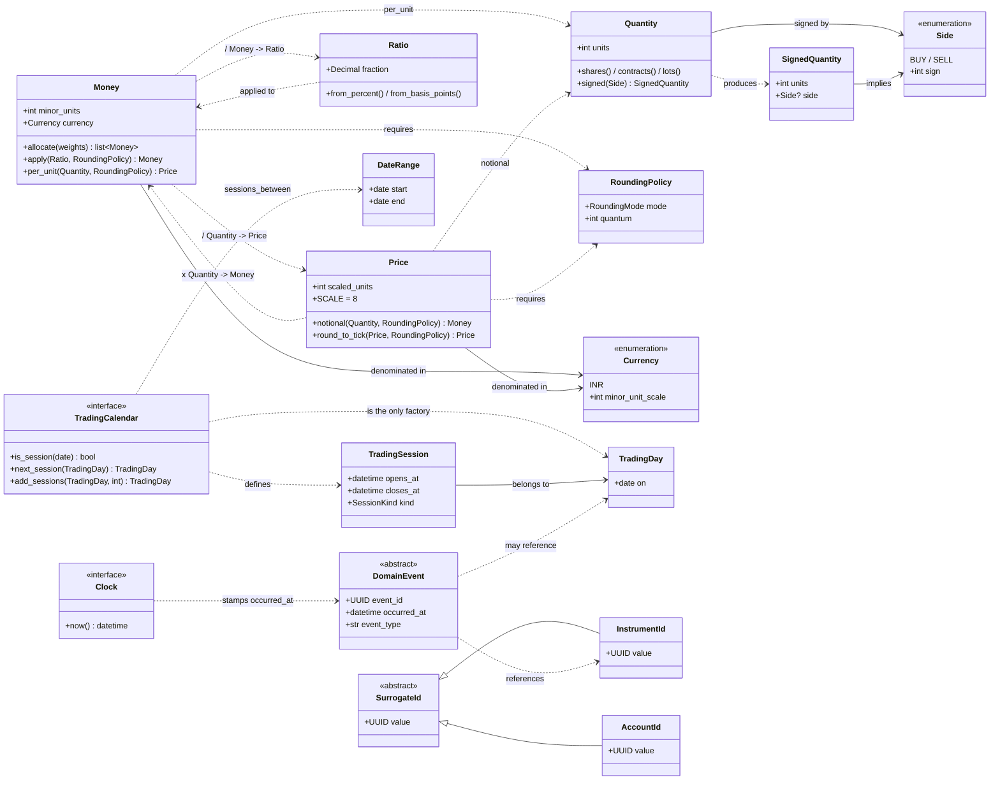

# The D.H.R.U.V.A Domain Model

**Why the shared kernel is shaped the way it is.**

This is not API documentation — the docstrings do that. This explains the
reasoning, so that a contributor in 2031 can tell the difference between a
constraint that is load-bearing and one that merely looks awkward.

Every rule here exists because of a specific failure it prevents. Where that
failure is a known category of financial-software bug, it is named.

---

## Contents

1. [Money versus Price](#1-money-versus-price)
2. [Why floating point is prohibited](#2-why-floating-point-is-prohibited)
3. [Dimensional typing](#3-dimensional-typing)
4. [Explicit rounding](#4-explicit-rounding)
5. [Quantity semantics](#5-quantity-semantics)
6. [TradingDay](#6-tradingday)
7. [The calendar abstraction](#7-the-calendar-abstraction)
8. [The clock abstraction](#8-the-clock-abstraction)
9. [Provider independence](#9-provider-independence)
10. [Domain events](#10-domain-events)
11. [The domain map](#11-the-domain-map)
12. [Common financial programming mistakes prevented by this design](#12-common-financial-programming-mistakes-prevented-by-this-design)

---

## 1. Money versus Price

They look like the same thing. They are not, and conflating them is the root of
several bugs further down this document.

**`Money` is an amount that exists.** ₹20,100 of consideration. A brokerage
charge. A realised gain. It settles; someone owes it or holds it.

**`Price` is a rate.** ₹100.50 *per share*. Nobody owes you ₹100.50 per share —
the phrase is incomplete until you say how many shares.

The distinction is the same one physics makes between a distance and a speed,
and it has the same consequence: they have different units, so they follow
different arithmetic.

### They also need different precision

This is the discovery that forced ADR-042, and it is worth stating plainly
because it nearly went unnoticed.

| Instrument | Quoted decimal places |
|---|---|
| NSE equities | 2 |
| NSE equity options | 2 |
| **NSE currency derivatives** | **4** — USD/INR ticks at ₹0.0025 |
| FX spot (convention) | 5 |

Money is denominated in a currency's minor unit: paise, two decimal places. That
is what settles, what a contract note shows, and what a `BIGINT` column stores.

A *price* fixed at two decimal places would have silently rounded every
currency-derivative quote. Nothing would crash. The error surfaces months later,
when a position fails to reconcile.

So: **`Money` is an integer count of minor units (2 dp for INR). `Price` is an
integer at a fixed scale of 8 decimal places** — four more than any Indian
instrument needs, with room for exchanges the platform does not yet support. At
eight places a `BIGINT` still reaches ₹92 billion.

The scale is fixed and never varies by instrument. Instrument metadata governs
*display* and *tick validation* (S07); it never changes what a price means
internally. A price that meant different things in different contexts would be
worse than one that is occasionally more precise than necessary.

---

## 2. Why floating point is prohibited

Because `0.1 + 0.2 != 0.3`, and because that is the least of it.

```python
>>> 0.1 + 0.2
0.30000000000000004
>>> 1234.56 * 3
3703.6800000000003
>>> sum(0.01 for _ in range(100))
1.0000000000000007
```

A binary float cannot represent most decimal fractions. Every operation rounds,
the errors accumulate, and they accumulate *asymmetrically* — so a running total
drifts in one direction. Over a backtest of ten thousand trades, that drift is
not noise; it is a bias.

The concrete failures this causes in financial software:

- **A reconciliation that never closes.** Your ledger says ₹1,00,000.00000000001;
  the broker says ₹1,00,000. They will never agree, and the difference is too
  small to find and too persistent to ignore.
- **A comparison that is wrong at the boundary.** `if position_value >= limit`
  admits a trade one paisa over the limit, or rejects one exactly at it.
- **A tax computed on a number that is not the number.** STT on ₹99,999.99999998
  rounds differently from STT on ₹1,00,000.

The rule is therefore absolute in the monetary layer, and **boundary rule R6
enforces it mechanically**: no module under `shared/money` may contain a float
literal, a `float()` call, or a `float` annotation. `isinstance(x, float)` is
permitted, because that is a guard *rejecting* a float.

### Where floats remain legitimate

Implied volatility, greeks, correlations, regression coefficients. These
**estimate** rather than **settle**. Nobody reconciles a delta against a contract
note. The rule is enforced where money is *counted*, not where the market is
*modelled* — and drawing the line there is what keeps the rule credible rather
than something people learn to suppress.

---

## 3. Dimensional typing

Money, price, quantity and rate are four different kinds of thing. The type
system is told, so it can refuse the combinations that make no sense.

**Operations that exist:**

| Expression | Result | Rounding |
|---|---|---|
| `Money ± Money` | `Money` | exact; same currency enforced |
| `Money × int` | `Money` | exact |
| `Money ÷ int` | `Money` | **policy required** |
| `Money ÷ Quantity` | `Price` | **policy required** |
| `Money ÷ Money` | `Ratio` | dimensionless |
| `Price × Quantity` | `Money` | **policy required** |
| `Price ± Price` | `Price` | a spread is still a price |

**Operations that deliberately do not exist:** `Money × Money`, `Price × Price`,
`Money + Price`, `Money + int`.

What is rupees-squared? Nothing. What does it mean to add ₹100 to ₹100-per-share?
Nothing. These are not edge cases to handle — they are sentences with no meaning,
and the compiler should say so.

### Enforced twice, on purpose

`mypy --strict` rejects `Money + Price` **before the code runs**. A runtime
`isinstance` guard returning `NotImplemented` sits beneath it, so an *untyped*
caller — deserialised JSON, a notebook, dynamic dispatch — gets a clean
`TypeError` rather than an `AttributeError` from a half-executed operation.

Static alone leaves untyped callers unprotected. Runtime alone gives up the
feedback that makes the constraint cheap to obey. The cost of both is one
narrowly scoped mypy exception, documented in `pyproject.toml`.

---

## 4. Explicit rounding

**Nothing in this platform rounds implicitly.** Every operation that can lose
precision takes a `RoundingPolicy`, chosen by the caller.

Policies are named after the *market rule*, not the *mathematical mode*:

```python
STT_NEAREST_RUPEE          # Securities Transaction Tax: whole rupees
CHARGE_TO_PAISE            # brokerage, exchange fees, SEBI turnover fees
GST_TO_PAISE               # GST on charges
STAMP_DUTY_NEAREST_RUPEE   # stamp duty under most state schedules
CONSERVATIVE_TO_TRADER     # pre-trade estimates only
STATISTICAL                # analytics, where no market rule applies
EXACT                      # refuses to round; raises instead
```

The naming matters because of who reads it. A reviewer checking a calculation
holds a SEBI circular, not a numerical-analysis textbook. `STT_NEAREST_RUPEE` can
be checked against that circular. `ROUND_HALF_UP` cannot.

### `CONSERVATIVE_TO_TRADER`

Rounds away from zero, so an estimated cost is never understated and an estimated
proceed never overstated. **For pre-trade estimates only** — settlement always
uses the exchange's actual rule.

It exists because optimistic cost estimates are one of the quieter ways a
strategy appears profitable and is not. A few basis points of understated cost,
applied across ten thousand simulated trades, is the difference between an edge
and a fiction. When we are guessing, we guess against ourselves.

### `EXACT` and why `price * quantity` still works

Two of our own rules pull in opposite directions. Dimensional typing wants
`Price × Quantity` to be writable. Explicit rounding forbids silent rounding.

The resolution: bare operators use `EXACT`. The expression is natural, and if the
result is not exactly representable it **raises**, with a message naming the
method that takes a policy.

```python
Price.parse("100.50") * Quantity.shares(200)     # → Money('20100.00')
Price.parse("100.005") * Quantity.shares(1)      # → raises: supply a policy
price.notional(quantity, CHARGE_TO_PAISE)        # → always works, states the rule
```

---

## 5. Quantity semantics

**`Quantity` is always unsigned. Direction lives in `Side`.**

The shortcut this rejects is encoding sell as a negative number. It works, costs
nothing, and everyone on the team understands it — until someone forgets, and a
position acquires the wrong sign. That failure is quiet: a wrongly-signed
position reconciles against nothing, produces a plausible P&L, and is usually
discovered when a real position disagrees with the platform's view of it.

`Side.sign` is the single place direction becomes a number. `SignedQuantity`
exists for position deltas, as a **distinct type** — so a function receiving one
never has to work out which it is holding.

### Lots versus units

```python
Quantity.shares(100)                 # 100 shares
Quantity.contracts(75)               # 75 contracts (units, not lots)
Quantity.lots(3, lot_size=75)        # 225 units — lot_size is required
```

`lot_size` has no default. F&O is quoted in lots and transmitted in units, and
the gap between "3 lots" and "3 contracts" is a **25-fold position error** for a
NIFTY lot of 75. A default would be a guess about an instrument this layer does
not know.

`in_lots()` raises on a partial lot rather than rounding. A partial lot is not a
rounding question; it is an order the exchange will reject, and it should surface
here rather than there.

Subtraction that would go negative raises rather than clamping at zero.
Subtracting more than you hold is a logic error upstream, and returning zero
would hide it at exactly the moment it matters.

---

## 6. TradingDay

**A `TradingDay` that cannot verify it is a trading day is a lie the type tells.**

It cannot be constructed without a calendar:

```python
TradingDay.of(date(2026, 7, 28), calendar)   # verified, or raises
```

And there is no `TradingDay + timedelta`. All session arithmetic goes through the
calendar.

### The concrete reason

On **1 September 2025**, NSE moved equity-derivative expiry from Thursday to
Tuesday, and BSE moved to Thursday — ending a twenty-five-year convention.

Any backtest spanning that date which computes "the next expiry" by date
arithmetic is wrong on one side of it. Nothing in the data flags this. The
results simply differ from reality, in a direction that can easily look like
alpha.

A second, smaller example from the same family:

```python
friday.on + timedelta(days=1)        # Saturday. Not a session.
calendar.next_session(friday)        # Monday. Correct.
```

---

## 7. The calendar abstraction

The `TradingCalendar` **port** lives in the shared kernel. The implementation
lives in the Reference context (S08).

Everything may depend on the *idea* of a calendar; only S08 knows the holidays.
That keeps the dependency direction right — the shared kernel imports no context —
and it means a test can supply its own calendar without pulling in a holiday
table.

Every "when" question about the market belongs on this port: `is_session`,
`session`, `next_session`, `previous_session`, `add_sessions`,
`sessions_between`. If code elsewhere is doing date arithmetic to answer one,
that code is wrong.

### Sessions are stored as UTC instants

Not as wall-clock times. India observes no daylight saving, so this costs nothing
today.

It matters because storing wall-clock times would **bake that assumption into the
schema**. An exchange that does observe DST would require every stored session to
be reinterpreted, and the reinterpretation would be ambiguous for exactly the
hours that matter. UTC instants have one meaning regardless.

### Partial sessions

`SessionKind` distinguishes `REGULAR`, `MUHURAT` and `SPECIAL`. Partial-ness is
**declared by the exchange**, not inferred from duration — a Muhurat session is
partial because it was declared so, and a regular session cut short by a halt is
still a regular session.

---

## 8. The clock abstraction

Nothing calls `datetime.now()`. Time arrives through an injected `Clock`.

Two reasons, and the first is the one that matters:

**Determinism.** ADR-010 requires strategy code to run *unchanged* in backtest,
paper and live. That is only possible if the strategy cannot tell which one it is
in — and the wall clock is the most obvious way it could tell. A strategy that
reads `datetime.now()` behaves differently in a backtest of 2023 than it did in
2023, and the difference is invisible.

**Testability.** A test that depends on the current instant fails on the first of
the month, during a leap second, or when CI is slow.

`FrozenClock` moves only when told, and only **forward**. A clock that can run
backwards can produce an event ordering that could not occur in reality, and
every downstream assumption about monotonic time would keep holding anyway —
until it did not.

---

## 9. Provider independence

Every entity is identified by a UUID we mint. Never by an identifier a third
party controls.

The specific reason: Zerodha's `instrument_token` is **not stable across contract
cycles**, and `tradingsymbol` changes on corporate actions and encodes expiry for
derivatives. Either works as a key right up until it does not — and the failure
is a position attributed to the wrong instrument.

Broker identifiers are **attributes with validity windows**, held by the
Reference context (S07). They are how we talk to Kite. They are not who anything
*is*.

```python
InstrumentId.new()                                  # random
InstrumentId.deterministic("NSE", "RELIANCE", "EQ") # stable, from exchange facts
```

The deterministic form derives from values the **exchange** defines, so
re-importing reference data does not mint duplicates.

Identifiers of different kinds never compare equal, even wrapping the same UUID.
An `InstrumentId` equal to an `AccountId` would make a cross-type dictionary
lookup succeed and silently return the wrong entity.

This is enforced, not merely intended: **a test walks the module's AST and fails
if any executable reference to a broker identifier appears in the shared kernel.**
Prose explaining why they are excluded is welcome; code is not.

---

## 10. Domain events

**A domain event is a fact that occurred.** Past tense, immutable, minimal.

It is not a command (`PlaceOrder`), not a workflow step, and not a DTO.
`OrderFilled` is a fact; `FillOrder` is an instruction, and instructions belong in
the application layer.

The distinction matters because **facts can be replayed and instructions cannot**.
An append-only ledger of facts reconstructs state at any point in history; a log
of instructions only tells you what somebody intended.

### Facts and envelopes are separate

`DomainEvent` carries the fact. Correlation identifiers, delivery attempts and
consumer offsets belong to the **envelope** that S05's bus wraps around it.

Keeping them apart means a fact means the same thing whether it arrived over
Redis Streams, was replayed from the ledger, or was constructed in a test. Baking
transport metadata into the fact would make replay produce events that are subtly
different from the originals.

`occurred_at` is when the fact became true — **not** when it was recorded. The
two differ whenever data arrives late, which in market data is most of the time,
and conflating them is how lookahead bias enters a backtest.

---

## 11. The domain map



**Reading the diagram.** Solid arrows are structural relationships; dashed arrows
are operations. The dashed arrows between `Money`, `Price` and `Quantity` are the
dimensional model — note that every one of them either requires a
`RoundingPolicy` or is exact by construction.

---

## 12. Common financial programming mistakes prevented by this design

Each of these is a real category of bug in trading systems. For each: what it
looks like, what it costs, and which decision stops it here.

### 12.1 The float that was almost right

```python
# Elsewhere
total = 0.0
for fill in fills:
    total += fill.price * fill.quantity        # drifts, asymmetrically
assert total == expected                        # fails by 1e-10, forever
```

```python
# Here — R6 rejects the float at build time; Money is exact
total = sum((f.price.notional(f.quantity, CHARGE_TO_PAISE) for f in fills),
            Money.zero())
```

**Prevented by:** ADR-042 (integer minor units), ADR-048 / rule R6.

### 12.2 The vanished paisa

```python
# Elsewhere — splitting ₹100 three ways
share = total / 3                    # ₹33.33 each
assert sum([share] * 3) == total     # ₹99.99. One paisa gone.
```

Across brokerage apportioned over legs, STT over fills, and P&L over lots, this
accumulates into a reconciliation break that takes a day to find.

```python
# Here — conservation of value is a property test, not a hope
total.allocate([1, 1, 1])            # [₹33.34, ₹33.33, ₹33.33] — sums exactly
```

**Prevented by:** largest-remainder allocation, asserted over arbitrary amounts
and weight vectors.

### 12.3 The negative quantity that meant sell

```python
# Elsewhere
position += order.quantity           # order.quantity was -100 for a sell
                                     # ...until someone passed abs() upstream
```

```python
# Here — the sign cannot carry meaning
Quantity.shares(-100)                # raises
position += order.quantity.signed(order.side)
```

**Prevented by:** ADR-045 (unsigned `Quantity`, explicit `Side`).

### 12.4 Lots mistaken for contracts

```python
# Elsewhere
place_order(symbol="NIFTY", quantity=3)   # meant 3 lots. Sent 3 units.
                                          # Or worse: meant 3 units, sent 3 lots.
```

For a NIFTY lot of 75, that is a 25-fold position error in whichever direction
hurts.

```python
# Here — the conversion is explicit and requires the instrument's lot size
Quantity.lots(3, lot_size=75)        # 225 units
Quantity.shares(100).in_lots(lot_size=75)   # raises: not a whole number of lots
```

**Prevented by:** ADR-045 (`lot_size` required, no default).

### 12.5 The rounding nobody chose

```python
# Elsewhere
stt = round(turnover * 0.00025, 2)   # STT rounds to the RUPEE, not to paise
```

Wrong by up to 99 paise per trade, in a direction that flatters the strategy.

```python
# Here — the rule is named at the call site
turnover.apply(Ratio.from_basis_points(25), STT_NEAREST_RUPEE)
```

**Prevented by:** ADR-044 (no default rounding; policies named for market rules).

### 12.6 The optimistic cost estimate

Pre-trade cost estimates rounded to nearest look harmless. Applied across ten
thousand backtested trades, a few basis points of understatement is the
difference between a viable edge and a fictional one.

```python
estimated_cost = turnover.apply(brokerage_rate, CONSERVATIVE_TO_TRADER)
```

**Prevented by:** `CONSERVATIVE_TO_TRADER` — when guessing, guess against
ourselves.

### 12.7 Expiry computed by date arithmetic

```python
# Elsewhere
expiry = last_thursday_of(month)     # correct until 2025-09-01. Then silently wrong.
```

```python
# Here — there is no way to express it except through the calendar
calendar.add_sessions(day, n)
```

**Prevented by:** ADR-046 (calendar-verified `TradingDay`, no `timedelta`
arithmetic).

### 12.8 The strategy that could see the clock

```python
# Elsewhere
if datetime.now().hour < 15:         # behaves differently in backtest than live
    ...
```

The backtest is then not a test of the strategy that will run.

```python
# Here — time is injected; the strategy cannot tell which mode it is in
if clock.now() < session.closes_at:
    ...
```

**Prevented by:** ADR-011 (`Clock` port), enforced by lint (`DTZ`) and by there
being no other way to obtain the time.

### 12.9 The naive datetime

```python
# Elsewhere
datetime(2026, 7, 28, 9, 15)         # 09:15 where? Stored, compared, and wrong.
```

```python
# Here — every boundary rejects it
FrozenClock(datetime(2026, 7, 28, 9, 15))     # raises
TimeRange(naive_start, aware_end)              # raises
```

**Prevented by:** ADR-006 (UTC everywhere), ruff `DTZ` rules, explicit guards.

### 12.10 The broker token used as identity

```python
# Elsewhere
positions[instrument_token] = ...    # token changes next contract cycle
```

The position is then attributed to the wrong instrument, and the historical
series silently splits in two.

```python
# Here
positions[instrument_id] = ...       # a UUID we minted, stable forever
```

**Prevented by:** ADR-009 (surrogate identity), enforced by an AST test.

### 12.11 The closed range that double-counted

```python
# Elsewhere
if start <= bar.time <= end:         # a bar on the boundary lands in two windows
```

The backtest then reports more trades than occurred.

```python
# Here — every range is half-open, so consecutive ranges tile exactly
if bar.time in TimeRange(start, end):
```

**Prevented by:** half-open `[start, end)` everywhere, asserted as a tiling
property test.

### 12.12 The secret that meant two things

A broker gives you two secrets: an application credential you enrol once, and an
access token a login mints every morning. Stored in one row they share a rotation
history and a blast radius.

```python
# Elsewhere — one credential per broker
store.put(broker="zerodha", secret=access_token)   # overwrites the API secret
```

The API secret is gone, `rotated_at` now records logins rather than rotations,
and the loss is discovered the next time the owner needs to authenticate.

```python
# Here — the lifecycle is part of the key and part of the binding
store.get(account_id, "zerodha", CredentialPurpose.SESSION)
```

A ciphertext moved between the two purposes fails to decrypt, so the separation
is enforced by the cipher rather than by callers remembering it.

**Prevented by:** ADR-077 (credential purpose participates in uniqueness and in
the AES-GCM associated data), enforced by a `CHECK` constraint, a
`(account_id, broker, purpose)` unique constraint, and cross-purpose theft tests
against real PostgreSQL.

### 12.13 Currency mixed without noticing

Not yet possible — only INR exists — but the guard is in place, and equality
already incorporates currency so that the day a second one appears, nothing
silently compares across them.

**Prevented by:** currency as a runtime attribute with an enforced equality
check.

---

## Changing any of this

As of S03, the shared kernel is **API-stable** (ADR-050). Any change to `Money`,
`Price`, `Quantity`, `Ratio`, `TradingDay`, `TradingCalendar`, `Clock`,
`InstrumentId` or `DomainEvent` requires a dedicated ADR and explicit approval
before implementation.

Forty subsystems will depend on these types. Churn here is not a local cost.
